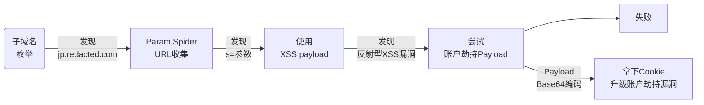

# URL注入测试经验

## 文章漏洞测试流程图

[URL注入：通过跨站脚本 (XSS) 发现账户劫持 (ATO) 漏洞](./URL注入：通过跨站脚本 (XSS) 发现账户劫持 (ATO) 漏洞.md)：

```mermaid
graph LR
A(子域名<br>枚举) -->|发现<br>jp.redacted.com|B[Param Spider<br>URL收集] 
B -->|发现<br>s=参数|C[使用<br>XSS payload] 
C -->|发现<br>反射型XSS漏洞|D[尝试<br>账户劫持Payload] 
D-->E[失败] 
D-->|Payload<br>Base64编码|F[拿下Cookie<br>升级账户劫持漏洞] 
```

