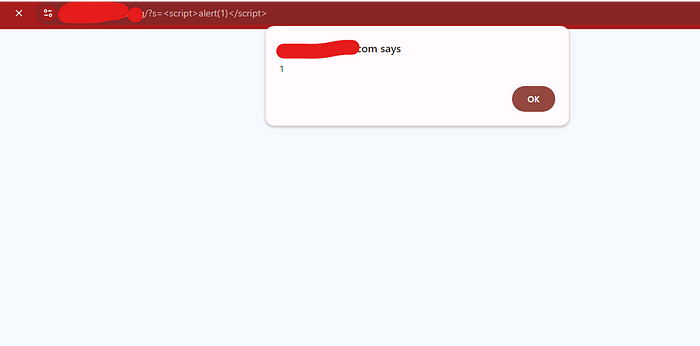
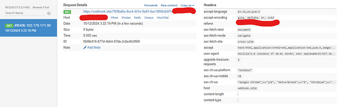

# URL注入：通过跨站脚本 (XSS) 发现账户劫持 (ATO) 漏洞

在寻找一个拥有数百万用户的程序时，我特别关注了一个大型博客网站，这里姑且称之为 `redacted.com`。我首先对其子域名进行了枚举。我发现的一个子域名是 `jp.redacted.com`。

接下来，我使用 `Param Spider` 工具来收集所有可能的参数。我使用的命令是：

```
param spider -d jp.redacted.com -s 
```

(该命令用于在终端列出所有可能的参数)

此命令在终端中列出了所有可能的参数。其中，我发现了一个名为 s= 的参数，它允许我使用简单载荷执行反射型 XSS (RXSS)：

```html
<script>alert(1)</script>
```



成功执行 XSS 后，我尝试使用简单载荷将其升级为 ATO （Account Takeover 即账户劫持）漏洞：

```HTML

```

然而，这种方法不起作用，我尝试了多种载荷都以失败告终。经过一番试验，我决定在输入载荷之前将其编码成 Base64 格式。令我惊讶的是，这样做的确让载荷在网站上执行，并成功捕获了受害者的 Cookie 信息。



我向该团队报告了通过 RXSS 漏洞导致的 ATO 漏洞，但遗憾的是，在过去的五个月里我都没有收到回复。


### 使用的工具：

**Param Spider：** Param Spider 是一款强大的工具，专门用于从 **Wayback Machine** 等网络存档中挖掘有价值的 URL，以支持进一步的渗透测试工作，如漏洞挖掘、模糊测试等。


