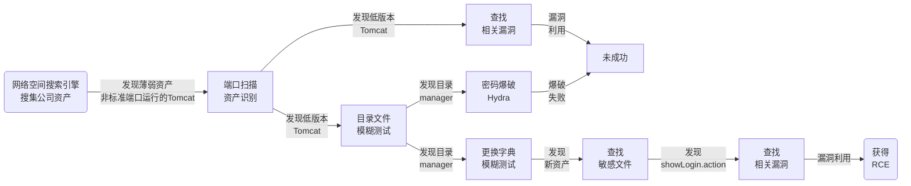

# Web服务器渗透测试经验

## 文章测试流程

[Web服务器渗透测试：利用Apache Struts2 S2-016(CVE-2013-2251) 漏洞获得RCE](../Web%E6%9C%8D%E5%8A%A1%E5%99%A8%2FWeb%E6%9C%8D%E5%8A%A1%E5%99%A8%E6%B8%97%E9%80%8F%E6%B5%8B%E8%AF%95%EF%BC%9A%E5%88%A9%E7%94%A8Apache%20Struts2%20S2-016%28CVE-2013-2251%29%20%E6%BC%8F%E6%B4%9E%E8%8E%B7%E5%BE%97RCE.md)：

