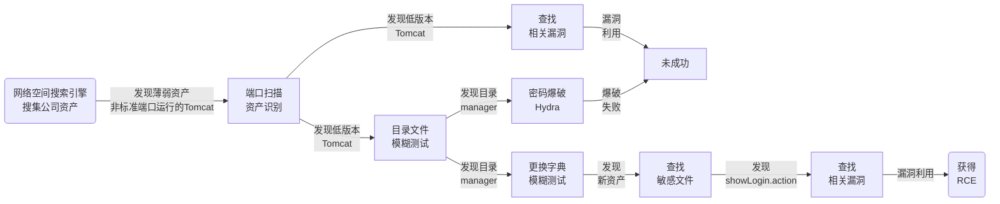

# Web服务器渗透测试经验

## 文章漏洞测试流程图

[Tomcat渗透测试：利用Apache Struts2 S2-016(CVE-2013-2251) 漏洞获得RCE](./Tomcat渗透测试：利用Apache Struts2 S2-016(CVE-2013-2251) 漏洞获得RCE.md)：

```mermaid
graph LR
A(网络空间搜索引擎<br>搜集公司资产) --> |发现薄弱资产<br>非标准端口运行的Tomcat|B[端口扫描<br>资产识别] 
B --> |发现低版本<br>Tomcat|C[查找<br>相关漏洞] 
C --> |漏洞<br>利用|D[未成功] 
B --> |发现低版本<br>Tomcat|E[目录文件<br>模糊测试] 
E --> |发现目录<br>manager|F[密码爆破<br>Hydra] 
E --> |发现目录<br>manager|G[更换字典<br>模糊测试] 
F --> |爆破<br>失败|D 
G --> |发现<br>新资产|H[查找<br>敏感文件] 
H --> |发现<br>showLogin.action|I[查找<br>相关漏洞]
I --> |漏洞利用|J(获得<br>RCE)

```

