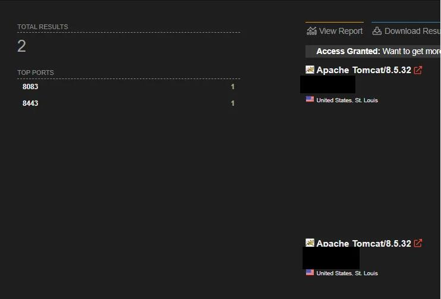
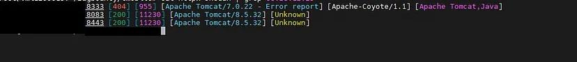
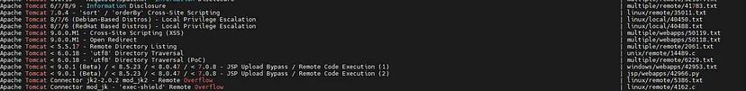
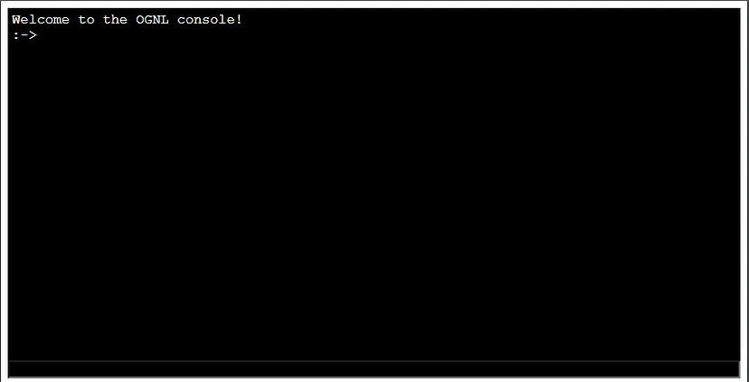
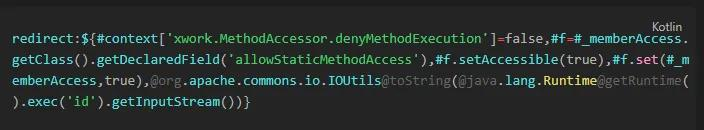

# Tomcat 渗透测试：利用Apache Struts2 S2-016(CVE-2013-2251) 漏洞获得RCE

在寻找可攻击的目标时，我总是优先考虑那些范围广泛、开放式的网站，因为它们能让我更自由地寻找匹配自身技能的资产。在决定攻击一个公开程序并完成子域名枚举后，我决定使用 Shodan 来查找该公司拥有的资产，并使用了以下查询语句：

```context
org:Company.Inc
```

在经过一番探索后，我发现了一个引人注目的目标，决定对其进行攻击。选择该目标的原因是，我发现它开放了非标准端口，而且运行着 **Tomcat/8.5.32** 版本。



首先，我对IP地址进行了全面的端口扫描，并将扫描结果传递给 `httpx` 工具，以检查其提供的HTTP服务。

```bash
naabu -host <ip> -p - -Pn -o portscan | httpx -sc -td -server
```


令我惊讶的是，我发现了更多开放端口，其中一个新发现的端口运行着HTTP服务。



我发现端口 `8333` 运行着另一个版本的`Tomcat` 服务器，这是要给有趣的发现，让我们继续测试。首先，让我们使用`searchploit` 工具搜索与该版本相关的CVE漏洞。

```bash
searchsploit "tomcat 7"
```



遗憾的是，上述的漏洞里利用方法均未成功，包括针对 CVE-2017-12617 和 CVE-2020-1938 的攻击。


回到主页后，我决定开始进行目录和文件模糊测试。首先，我使用默认字典列表尝试使用`dirsearch`工具。

```bash
dirsearch -u http://x.x.x.x:8333
```

然而，除了`manager`和'host-manager'目录之外，我没有发现其他有趣的结果，这两个目录返回了401错误。因此，我决定使用`Hydra`工具尝试默认凭据。

```bash
hydra -L ~/tomcat-usernames -P ~/tomcat-passwords x.x.x.x -s 8333 http-get /manager/html
```

再次一无所获。


再次进行模糊测试，这次使用来自[GitHub - six2dez/OneListForAll](https://github.com/six2dez/OneListForAll) 的`shortlist` 词表。

```bash
dirsearch -u <http://x.x.x.x:8333> -w ~/wordlist/OnelistForAll/onelistforallshort.txt
```

这次我发现了一个新的目录`/sdp/>>302>>/sdp/validateUser.action`，其中包含一个登录表单。

因此，我立即开始测试是否存在SQL注入漏洞，但没有成功。然后我记起 CVE-2017-5638，所以我是用`nuclei`模板对该端点进行了测试，但仍然没有发现任何结果。


回到`/sdp/`端点之后的目录模糊测试中，这次我发现了一个新的目录：`/sdp/struts/webconsole.html?debug=console`



那一刻，我非常高兴，以为自己找到了RCE（远程命令执行）漏洞。但随后，我又遇到了无数次的问题：控制台出现了大量JS错误，每次修复一个，另一个又出现。最后，我只能在OGNL（Object-Graph Navigation Language） 控制台中打印HTML代码，无法执行命令。

回到Burp Session的历史选项卡中，滚动浏览时，我发现了一个新文件：`showLogin.action`。出于绝望，我决定尝试一个我在搜索Apache Struts 2 和OGNL注入相关的实验室和文章时找到的有效负载。



该有效负载会在服务器上执行id命令。我将该负载添加到`showLogin.action` 并作为Get请求发送。突然，意想不到的事情发生了。当时我的反应是-->


接下来，我将此问题报告给`BugCrowd`它们立即进行了分类，但该计划后来将其降级为P2，称其为旧资产，并通过删除IP来解决。

原文链接：[https://medium.com/@yousefmoh15/how-i-got-rce-in-one-of-bugcrowds-public-programs-5725c8dc46ce](https://medium.com/@yousefmoh15/how-i-got-rce-in-one-of-bugcrowds-public-programs-5725c8dc46ce)

# 使用的工具

- 网络空间搜索引擎：[Shodan](https://www.shodan.io/)
- 批量端口扫描神器：[Naabu](https://github.com/projectdiscovery/naabu)
- Web资产探测神器：[Httpx](https://github.com/projectdiscovery/httpx)
- 开源漏洞利用程序数据库：[Exploit-DB](https://www.exploit-db.com/searchsploit)
- 目录及文件模糊测试工具：[dirsearch](https://github.com/maurosoria/dirsearch)
- 多协议密码破解神器：[THC Hydra](https://github.com/vanhauser-thc/thc-hydra)
- 最受欢迎的开源漏扫工具：[nuclei](https://github.com/projectdiscovery/nuclei)
- Web安全测试神器：[Burp suite](https://portswigger.net/burp)

