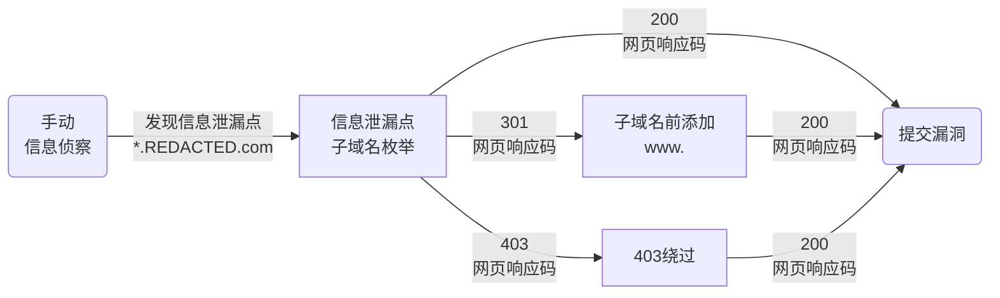

# 敏感信息泄露渗透测试经验

## 文章测试流程

[子域名枚举：敏感信息泄露扩大战果，最终获得4000美元.md](./子域名枚举：敏感信息泄露扩大战果，最终获得4000美元.md)：

```mermaid
graph LR
B(手动<br>信息侦察 ) --> |发现信息泄漏点<br>*.REDACTED.com|C[信息泄漏点<br>子域名枚举] 
C --> |200<br>网页响应码| D(提交漏洞)
C --> |301<br>网页响应码| E[子域名前添加<br>www.]
C --> |403<br>网页响应码| F[403绕过]
E --> |200<br>网页响应码| D(提交漏洞)
F --> |200<br>网页响应码| D(提交漏洞)
```

