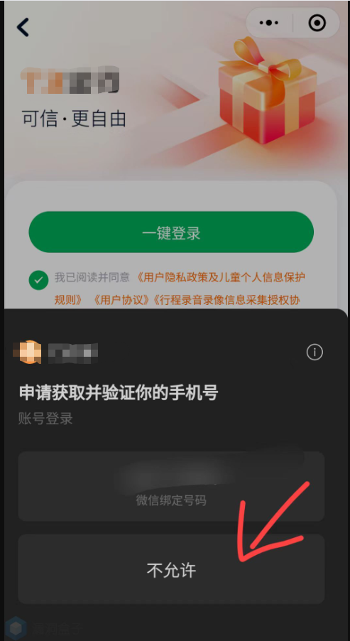

# 短信轰炸：微信小程序逻辑漏洞

## 漏洞产生点：

微信小程序登录页面。

## 漏洞复现：

**正常登录流程：（有限制）**

小程序—>登录—>微信绑定手机号—>继续—>短信—>验证—>登录成功/登录失败；

小程序—>登录—>不允许获取手机号—>结束；

**错误登录流程：（没有限制）**

小程序—>登录—>不允许—>结束—>使用其他手机号进行登录—>输入手机号—>图形验证码—>验证码—>重发即可

**测试截图：**

## 修复建议：

**发送频率限制：**

在服务端设置发送频率限制，例如每分钟只能发送一条短信，并对单个用户（或IP）设置最大发送条数限制，如每天不超过5条。这可以有效防止恶意用户通过连续发送请求来进行短信轰炸。

**原文链接：[https://mp.weixin.qq.com/s/8mgOzhc2PeQPAuXrT5vY8Q](https://mp.weixin.qq.com/s/8mgOzhc2PeQPAuXrT5vY8Q)**

