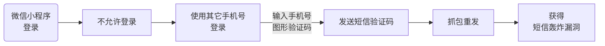

# 短信验证码测试经验

## 文章漏洞测试流程图

[短信轰炸：微信小程序登录逻辑漏洞](./短信轰炸：微信小程序登录逻辑漏洞.md)：

```mermaid
graph LR
B(微信小程序<br>登录) --> C[不允许登录] 
C --> D[使用其它手机号<br>登录]
D --> |输入手机号<br>图形验证码|E[发送短信验证码]
E --> F[抓包重发]
F --> G[获得<br>短信轰炸漏洞]

```

