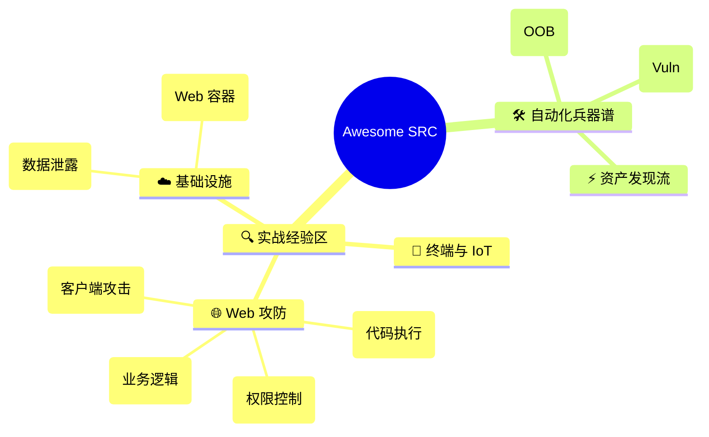
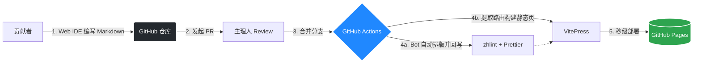

# ✨ Awesome SRC Experience

**让漏洞挖掘不再是“盲人摸象”。**

[**👉 访问官方文档站**](https://owl234.github.io/Awesome-SRC-experience/)

---

专注于 SRC 漏洞挖掘的现代实战知识库。基于 VitePress 构建，追求极致的阅读与检索体验。

- **定位**：面向实战的白帽子工程化漏洞体系。
- **愿景**：打破信息壁垒，让漏洞挖掘从“黑盒试探”走向“降维打击”。

## 🎯 核心图谱

摒弃散装笔记，构建“教科书级”漏洞族谱：

```mermaid
mindmap
  root((Awesome SRC))
    🔍 实战经验区
      🌐 Web 攻防
        access-control(权限控制)
        logic-flaw(业务逻辑)
        rce(代码执行)
        xss(客户端攻击)
      ☁️ 基础设施
        web-servers(Web 容器)
        info-leak(数据泄露)
      📡 终端与 IoT
    🛠️ 自动化兵器谱
      🔭 漏扫引擎 (Vuln)
      🛰️ 带外探测 (OOB)
      ⚡ 资产发现流
```

- **实战闭环**：背景 -> 攻坚 -> 自动化。
- **高 ROI 案例**：聚焦核心业务，从边界突破到云原生基础设施。
- **现代化兵器**：深度整合一线自动化生产力工具。

---

## 🗺️ 快速导航

- 📖 [**SRC 攻防实战**](https://owl234.github.io/Awesome-SRC-experience/experience/README)
- 🛠️ [**自动化兵器谱**](https://owl234.github.io/Awesome-SRC-experience/tools/Readme)

## 🛠️ 无服务器架构流转

坚持“零配置、无后端”的极简工程学：

- **渲染引擎**: VitePress (毫秒级路由热刷新)。
- **路由引擎**: Node.js AST 拦截，自动提取 Title 生成无限级侧边栏。
- **排版引擎**: Prettier + zhlint，拦截并修复中英文混排空格。
- **部署管道**: GitHub Actions CI/CD 流水线。

```mermaid
graph LR
    A[贡献者] -->|1. Web IDE 编写 Markdown| B(GitHub 仓库)
    B -->|2. 发起 PR| C[主理人 Review]
    C -->|3. 合并分支| D{GitHub Actions}
    D -->|4a. Bot 自动排版并回写| E[zhlint + Prettier]
    D -->|4b. 提取路由构建静态页| F[VitePress]
    E -.-> F
    F -->|5. 秒级部署| G[(GitHub Pages)]

    style B fill:#24292e,stroke:#fff,stroke-width:2px,color:#fff
    style D fill:#2088FF,stroke:#fff,stroke-width:2px,color:#fff
    style G fill:#2ea44f,stroke:#fff,stroke-width:2px,color:#fff
```

## 🤝 沉浸式共建

无需克隆代码到本地，打破所有参与门槛：

1. **一键 Web IDE**：点击页面「参与共建」，浏览器秒开原生编辑器。
2. **零心智负担**：你只管写。保存后，底层引擎会自动接管排版格式化与路由更新。

[**👉 立即提交战报**](https://owl234.github.io/Awesome-SRC-experience/contribute)

---

