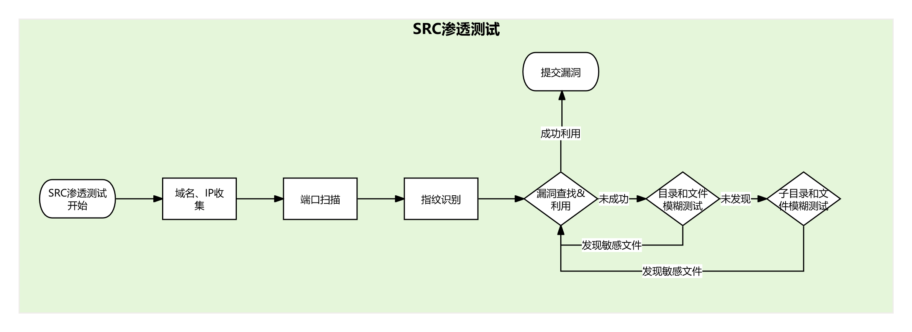

# ✨ Awesome SRC Experience

  
  
  
  

> **让漏洞挖掘不再是“盲人摸象”。**
>
> 这是一个专注于国内外 SRC (安全应急响应中心) 漏洞挖掘的实战经验、核心知识与高效工具合集。
>
> **核心特色**：每篇核心文章均配备**渗透测试思路流程图**，帮你建立结构化的挖洞思维，拒绝碎片化学习。

---
## 🗺️ 核心导航 (Table of Contents)

**企业为防止对系统的潜在危害如：数据泄露、系统稳定性等，所以SRC漏洞挖掘通常明令禁止后渗透测试。**

- [📖 SRC 挖洞秘诀与实战案例](./Awesome_SRC_experience)
  - [403 页面绕过思路与实战](./Awesome_SRC_experience/403页面)
  - [URL注入测试](./Awesome_SRC_experience/URL注入)
  - [Web服务器渗透测试](./Awesome_SRC_experience/Web服务器)
  - [敏感信息泄露测试](./Awesome_SRC_experience/敏感信息泄露)
  - [短信验证码测试](./Awesome_SRC_experience/短信验证码)
  - [管理页面测试](./Awesome_SRC_experience/管理页面)
- [🛠️ 兵器谱 (高频好用工具)](./工具)
  - [带外测试平台](./工具/带外测试平台)
  - [漏扫工具](./工具/漏扫工具)
  - [漏洞利用](./工具/漏洞利用)
  - [自动化漏洞发现](./工具/自动化漏洞发现)

## Star History

