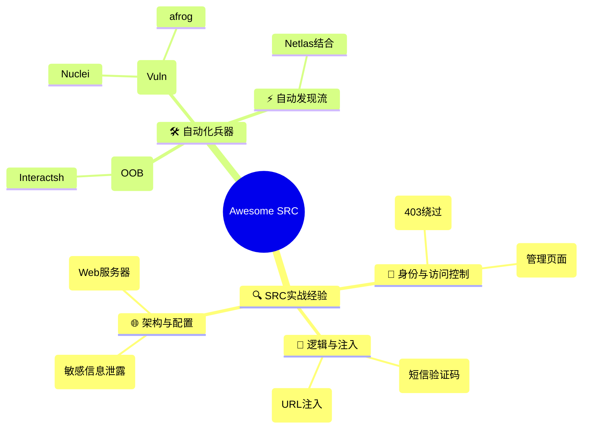

# ✨ Awesome SRC Experience

**让漏洞挖掘不再是“盲人摸象”**

[**👉 点击访问官方沉浸式文档站 (VitePress 全新驱动)**](https://owl234.github.io/Awesome-SRC-experience/)

---

**Awesome SRC Experience** 是一个专注于国内外 SRC (安全应急响应中心) 漏洞挖掘的实战经验、核心知识与高效工具合集。采用现代化的 VitePress 架构，支持全局搜索与暗黑模式，提供极致的阅读和检索体验。

## 🎯 核心能力与拓扑架构

本知识库主要围绕**实战漏挖**与**自动化兵器**展开：

```mermaid
mindmap
  root((Awesome SRC))
    🔍 SRC实战经验
      🔐 身份与访问控制
        403-bypass(403绕过)
        admin-panels(管理页面)
      💉 逻辑与注入
        url-injection(URL注入)
        sms-verification(短信验证码)
      🌐 架构与配置
        web-servers(Web服务器)
        info-leak(敏感信息泄露)
    🛠️ 自动化兵器
      🛰️ 带外平台 (OOB)
        Interactsh
      🔭 漏扫利器 (Vuln)
        Nuclei
        afrog
      ⚡ 自动发现流
        Netlas结合
```

1. **结构化的渗透思维**：每篇核心文章均配备标准三段式结构，拒绝零散学习，塑造职业化挖洞路径。
2. **高 ROI 的实战案例**：聚焦高频中大厂漏洞，涵盖 `403绕过`、`URL重定向`、`短信逻辑缺陷` 等真实战线经验。
3. **现代化的兵器利刃**：深度整合 `Nuclei`, `Interactsh`, `Netlas` 等一线 SRC 专家使用的自动化与带外扫描能力。

---

## 🗺️ 沉浸式快速导航
- 📖 [**SRC 攻防实战 (Practical Experience)**](https://owl234.github.io/Awesome-SRC-experience/experience/README)
- 🛠️ [**自动化利器 / 兵器谱 (Modern Tooling)**](https://owl234.github.io/Awesome-SRC-experience/tools/Readme)

*(若您在 GitHub Web 端阅读，可进入 [`docs/`](./docs) 目录直接查阅 Markdown 本地源文件)*

## 🤝 贡献与极客共建
我们推崇“分享是最好的学习”。为降低共建门槛，我们实现了**完全透明的知识流水线**：

1. **0 配置索引**：只需将 Markdown 放到对应子目录下（如 `docs/experience/403-bypass/`），系统会在发布时**自动提取 H1 标题并填充侧边栏**。
2. **标准模板**：点击 `New Issue` 即可看到预设的经验提交模板，帮助您快速输出标准化技术文档。
3. **极简命名**：我们对物理文件树进行了重新建模（Slugified），确保护链持久且语义清晰。

[**🔥 立即提交你的第一篇 SRC 经验**](https://github.com/owl234/Awesome-SRC-experience/issues/new/choose)

---
*Powered by VitePress & Awesome Community · 让漏洞挖掘不再是“盲人摸象”*

## 📈 Star 增长曲线

