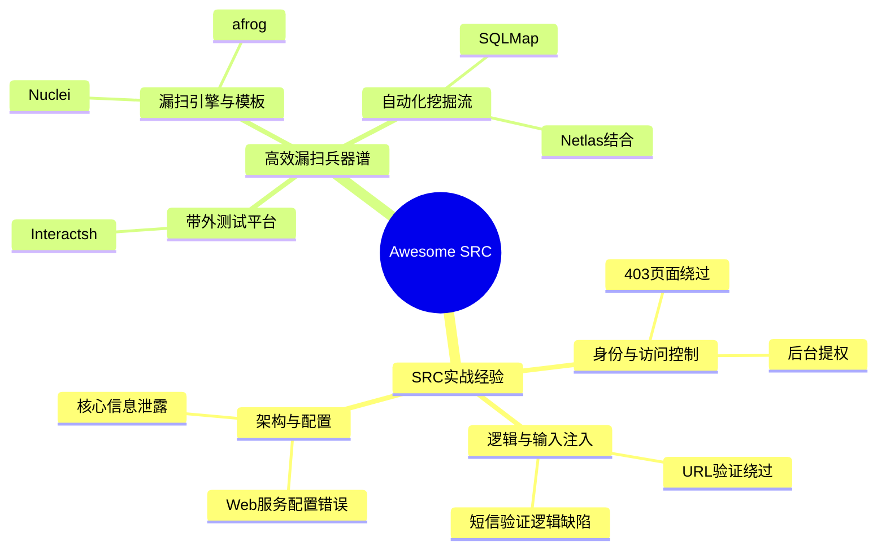

# ✨ Awesome SRC Experience

**让漏洞挖掘不再是“盲人摸象”**

[**👉 点击访问官方沉浸式文档站 (VitePress 全新驱动)**](https://owl234.github.io/Awesome-SRC-experience/)

---

**Awesome SRC Experience** 是一个专注于国内外 SRC (安全应急响应中心) 漏洞挖掘的实战经验、核心知识与高效工具合集。采用现代化的 VitePress 架构，支持全局搜索与暗黑模式，提供极致的阅读和检索体验。

## 🎯 核心能力与拓扑架构

本知识库主要围绕**实战漏挖**与**自动化兵器**展开：

```mermaid
mindmap
  root((Awesome SRC))
    SRC实战经验
      身份与访问控制
        403页面绕过
        后台提权
      逻辑与输入注入
        URL验证绕过
        短信验证逻辑缺陷
      架构与配置
        Web服务配置错误
        核心信息泄露
    高效漏扫兵器谱
      带外测试平台
        Interactsh
      漏扫引擎与模板
        Nuclei
        afrog
      自动化挖掘流
        SQLMap
        Netlas结合
```

1. **结构化的渗透思维**：每篇核心文章均配备实战复现步骤，帮你建立结构化的挖洞思维，拒绝碎片化学习。
2. **高 ROI 的实战案例**：涵盖 403 页面绕过、URL 注入、Web服务器渗透、敏感信息泄露、逻辑漏洞等一线实战场景。
3. **现代化的兵器谱**：收录并精讲 Nuclei, Interactsh, Netlas 等自动化漏扫和带外测试 (OOB) 利器。

---

## 🗺️ 快速导航

- 📖 **SRC 实战经验** -> [前往体验站沉浸式阅读](https://owl234.github.io/Awesome-SRC-experience/experience/)
- 🛠️ **自动化利器/兵器谱** -> [掌握现代化扫洞工具](https://owl234.github.io/Awesome-SRC-experience/tools/)

*(若你喜欢在 GitHub 原生界面阅读，请前往 [`docs/`](./docs) 目录下查阅最新的 Markdown 文档)*

## 🤝 贡献与极客共建

如果你有独到的 SRC 挖洞经验或者私藏的利器，欢迎提交 PR 参与共建！为降低协作摩擦并保持内容高质量标准，请参照以下流程：

1. **使用官方模板**：请使用系统预设的 `.github/ISSUE_TEMPLATE` 提交（经验文档推荐包含“漏洞背景”、“原理复现”与“修复建议”三段式结构）。
2. **脱敏处理**：在提交实战案例时，请务必将涉及企业真实系统名称、IP 或域名的部分进行打码脱敏。
3. **增加索引**：如果你提交了新文章，请顺手在 `docs/.vitepress/config.mjs` 中的 `sidebar` 下添加文章路由，并确保路由正确。

我们期待你的高质量分享！

## 📈 Star 增长曲线

