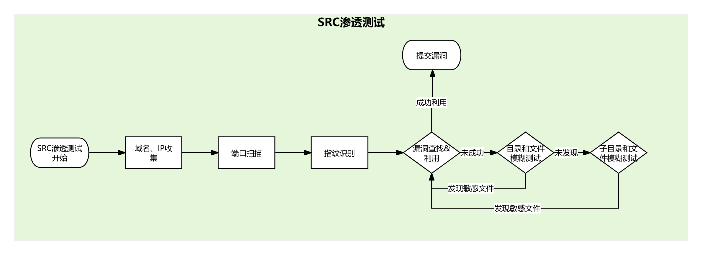

# :sparkles: Awesome-SRC-experience

国内外一些好用的SRC漏洞挖掘经验、知识、思路、工具分享。

每篇文章均配备渗透测试思路流程图，以方便快速查阅，选择性学习。

简单将渗透测试流程抽象为以下模块，方便基础知识和工具分类：

**企业为防止对系统的潜在危害如：数据泄露、系统稳定性等，所以SRC漏洞挖掘通常明令禁止后渗透测试。**

## :heart: 工具

根据上述流程图功能，在实际SRC挖掘过程中比较好用的工具，供大家针对性学习。（根据实际使用情况不间断更新~）

## :star: 基础知识

一些SRC漏洞挖掘和渗透测试需要的基础知识。

## Star History

