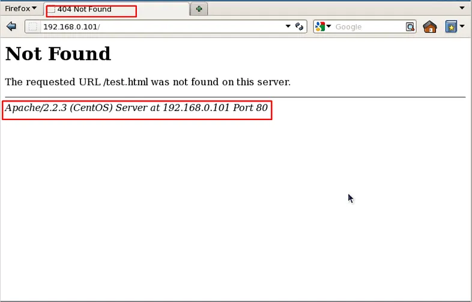

# 如何发现并利用信息泄露漏洞？

信息泄露漏洞是发现和报告的重要目标。虽然它们可能不会带来很丰厚的回报，但发现它们表明Web应用程序的安全性较差，这可能有助于发现更严重的漏洞。

## 常见的信息泄露漏洞类型

### 服务器标识版本

服务器标识版本能够揭示服务器上运行的特定软件及其版本，这可以被用来寻找已知漏洞。

### 错误信息

详细的错误信息可以提供有关服务器的配置、目录结构甚至使用的技术线索，这些信息都可以被攻击者利用。

### 源代码泄露

直接访问应用程序的源代码，可能暴露代码中的漏洞、硬编码的凭证以及其他敏感信息。

### 配置文件泄露

配置不当的服务器可能会暴露配置文件，这些文件包含敏感信息，如数据库凭证、API密钥和系统设置。

### 目录列表

不受限制的目录列表可以揭示网站目录和文件的结构，可能暴露敏感信息或可利用的文件。

### 备份文件和旧版本

发现备份文件或网站的旧版本，可以让攻击者获得过时的软件版本或配置，而这些旧版本可能存在已知的漏洞。

### HTML/JavaScript注释

在HTML或JavaScript 文件中留下的注释，可能会无意中泄露敏感信息或调试细节，这些信息对于攻击者来说非常有用。

### Api响应

Api响应包含不必要的数据，可能会泄露内部服务器细节、数据库结构或其他敏感信息。

### URL中的敏感信息

将会话令牌、用户名或其他敏感数据包含在URL中，这些信息可能会被拦截利用。

### 第三方服务

与第三方服务的集成，如果不进行适当的保护或配置，也可能导致信息泄露。

## OSINT 工具&方法

### 1. Whatweb

Whatweb 是一款用于识别网站的工具，它通过纰漏服务器信息（包括版本、IP地址、网页标题和运行的操作系统）来帮助我们获取Web应用程序的banner。

```bash
whatweb <website URL>
```


### 2. cURL

cURL命令包含从HTTP服务器获取banner信息的功能。

```bash
curl -s -I <website URL>
```

### 3. Nmap

Nmap也可以作为简单的banner抓取工具。它会连接到一个开放的TCP端口，并在几秒内打印出监听服务发送的任何信息。

输入以下命令，它将抓取远程主机22端口上运行的SSH服务的banner。

```bash
nmap -sV -p22 "IP"
```

-sV 参数输出运行服务器的版本。

### 4. 检查网页头部信息

```html
HTTP/1.1 302 Found 
Cache-Control: private, must-revalidate 
Connection: keep-alive Date: Mon, 19 Oct 2015 14:28:01 GMT Server: nginx/1.8.0
```

头部信息经常泄露服务器版本，这是由于配置不当造成的。

### 5. 检查错误信息

你可以请求一个不存在的页面，看看返回的消息，它可能泄露服务器版本。



### 6. 源代码泄露

获取应用程序的源代码可能会暴露代码中的漏洞，硬编码的凭证和其他敏感信息。以下是一些用于识别和缓解此问题的方法和示例。

#### 监测源代码泄露的方法

##### 搜索引擎（Google Hacking）

使用特定的搜索查询（dork）来查找暴露的源代码文件。

**示例：** 

```context
intitle:"index of" "config.php" or filetype:env 
```

##### URL 操纵

检查修改URL是否能暴露源代码文件。

**示例：**

访问 `https://example.com/config.php.bak` 或`https://example.com/.env` 查找备份或环境文件。

##### 目录遍历

测试是否存在访问源代码文件的目录遍历漏洞。

**示例：** 

访问`https://example.com/index.php?page=../../../../etc/passwd` 尝试访问敏感文件。

##### 备份和旧版本

搜索备份文件或网站的旧版本

**示例：** 

```url
https://example.com/backup.zip
https://example.com/old/index.php
```

##### 误配置的代码仓库：

寻找暴露的Git或SVN代码仓库。

**示例：** 

```url
https://example.com/.git/
https://example.com/.svn/
```

#### 源代码泄露示例

1. **Git 代码库暴露：** 攻击者访问`https://example.com/.git/`并下载整个代码库，从而泄露源代码和提交历史记录，其中可能包含敏感信息。

2. **暴露的配置文件：** 服务器配置从无，允许访问` https://example.com/config.php` ,该文件包含数据库凭证、API密钥和其他敏感配置信息。

3. **备份文件下载：** 攻击者通过目录遍历或URL猜测等方式找到`https://example.com/backup.zip`，并下载该备份文件，其中可能包含整个网站的源代码和敏感数据。

4. **环境变量泄露：** 访问` https://example.com/.env` 会泄露环境变量，例如数据库连接字符串、密钥等应用程序使用的敏感信息。

## 总结

以上是一些基本的信息泄露的检测方法，可以帮助你找到应用程序的泄露文件，帮助发现更有深度的漏洞，当然还有更多其他方法可以找到，但并非所有方法都可行，需要在不断的尝试中去积累经验。


