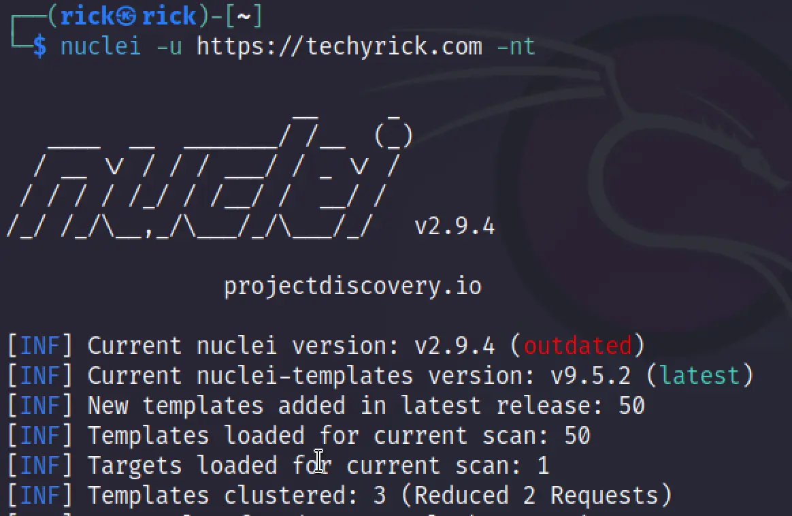

# Nuclei 最全教程

## 简介

在这篇文章中，你将学习Nuclei是什么，它是如何工作的以及所有与该工具相关的命令。

## 什么是 Nuclei

Nuclei是一款漏洞分析工具。Nuclei通过基于模板向目标发送请求，从而实现零误报，并能够快速扫描大量主机。

Nuclei支持多种协议进行扫描，包括TCP、DNS、HTTP、SSL、FILE、Whois、Websocket、Headless等等。

仅仅使用Nuclei，我们就可以进行大量的安全检查，其结果非常出色。

Nuclei的一些替代工具包括IpenVAS、Nessus、Nikto。我个人比较喜欢Nessus和OpenVAS。

简单来说，Nuclei是一款具有额外功能的漏洞分析工具。

## Nuclei 的特性

- 基于YAML的模板
- 可扩展的模板库
- 支持多种协议
- 并行快速扫描
- 与其他工具集成

## 如何安装Nuclei

在安装Nuclei之前，请确保你已经安装了Go语言环境以及相关的依赖。以下命令用于安装Nuclei：

```bash
Linux: sudo apt-get install nuclei 
Win: go get -u github.com/projectdiscovery/nuclei/v2/cmd/nuclei
```

## 如何使用Nuclei

仔细按照以下示例操作，到文章末尾，你将对这个工具非常熟悉。如果你能持续练习2-4小时，你将成为一个专业用户。

努力工作，直到你达到目标，让我们开始吧！

### 默认模式

在默认模式下，我们只需要提供一个域名作为扫描目标，无需添加其他命令。此外，如果存在开放端口，我们可以将其添加到命令中，以获得更具体的结果。

```bash
nuclei -u http://techyrick.com
```


我发现我的站点存在开放端口，并且我想扫描其中的22号端口（SSH）。


这些命令将使用Nuclei扫描数千种已知的漏洞，并枚举目标的相关信息。扫描结果非常出色，你可以尝试在我的站点上进行扫描，查看详细的DNS记录结果。我对此感到非常惊讶。

### 扫描多个站点

为了扫描多个站点，我们可以添加`-l`命令。

```bash
nuclei -l domains.txt
```


### 工具集成

我们可以集成多个工具来减少工作量并获得更出色的结果。

```bash
subfinder -d domains.txt | httpx | nuclei -t "http/technologies/prestashop-detect.yaml"
```


### 过滤

如果你不知道针对目标应该使用哪个模板，那么直接使用自动选择功能即可。

```bash
nuclei -u http://techyrick.com -as
```


如果你想使用最新的模板，可以尝试以下命令。

```bash
nuclei -u http://techyrick.com -nt
```



我们还可以添加特定的模板来扫描目标。


你知道的，我们可以通过标签进行过滤，请查看下面的命令。

```bash
nuclei -u https://jira.techyrick.com -tags jira,generic
```

按严重性选择模板。

```bash
nuclei -u http://techyrick.com -s critical,high,medium,low,info -as
```


### 模板

想知道我从哪里获取的模板吗？请查看以下链接：

https://nuclei-templates.netlify.app/

在搜索选项中，你可以输入任何你需要的内容。例如，如果你需要DNS结果，只需输入DNS并复制yaml脚本并针对目标运行即可。

你还可以找到许多有关OSINT、PD Teams、CVE-2023、RCE和接管的模板。


### 速率限制

可以使用`-rlm <int>` 选项以每分钟请求数的形式指定速率限制。

```bash
nuclei -u http://techyrick.com/ -rl 3 -c 2
```


我们还可以设置超时、重试和错误次数。

- 超时时长(-timeout)（默认值是5）
- 重试次数(-retries)
- 错误次数(-mhe)

### 恢复扫描

我们还可以恢复扫描，所有的扫描结果将保存在`/home/user/.config` 目录下。

```bash
nuclei -l domains.txt -resume /home/rick/.config/nuclei/resume-ci5g1996u63ag4n7897g.cfg
```


## 结论

在我个人看来，这是最好的漏洞分析下工具之一。使用它非常有趣，而且比Nikto更好。

我们下篇文章再见。