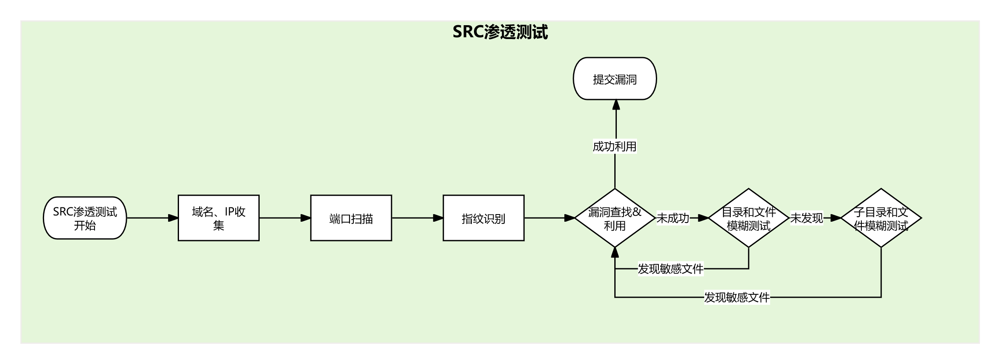

## :heart: Tools

为了给庞杂的渗透测试工具分类，我们简单将渗透测试流程抽象为以下几个模块：

每个工具会根据其优势，正确匹配到各个模块中，供大家针对性学习。

### :star: 端口扫描

- [Naabu](https://github.com/projectdiscovery/naabu) ：一款用Go语言编写的端口扫描工具，能快速枚举主机上的有效端口。这是一个非常简单的工具，可对主机或主机列表执行快速SYN/CONNECT/UDP扫描并列出所有返回响应的端口。

### :ant: URL 枚举

- **Param Spider：** [Param Spider](https://github.com/devanshbatham/ParamSpider) 是一款强大的工具，专门用于从 **Wayback Machine** 等网络存档中挖掘有价值的 URL，以支持进一步的渗透测试工作，如漏洞挖掘、模糊测试等。

### :eyeglasses:  指纹识别

- [httpx](https://github.com/projectdiscovery/httpx) ：一款快速且多功能的HTTP工具包，支持使用retryablehttp库运行多个探针。旨在即使在使用多线程的情况下也能保持结果可靠性。可用于技术栈和Web服务器探测。

### :dizzy: 带外测试平台

- [Interactsh](https://app.interactsh.com/)：Interactsh 是一种用于带外数据提取的开源解决方案，它是一种用于检测导致外部交互的错误（例如盲 SQLi、盲 CMDi、SSRF 等）的工具。

- [EYES](https://github.com/lijiejie/eyes.sh)：[eyes.sh](http://eyes.sh/) 是用来辅助安全测试和漏扫工具的DNS Log / HTTP Log检测工具，基于 [BugScan DNSLog](https://github.com/bugscanteam/dnslog/) 优化。

### :computer: 漏洞利用

- [Metasploit-framework](https://github.com/rapid7/metasploit-framework) : Metasploit-framework 是一组拥有信息收集、扫描、漏洞利用、漏洞挖掘、后渗透等的开源渗透测试框架，常用于漏洞利用和后渗透测试。

### :mag: ​漏扫工具

- [Nuclei](https://github.com/projectdiscovery/nuclei)：Nuclei 用于根据模板向目标发送请求，从而实现零误报，并可在大量主机上提供快速扫描。Nuclei 提供多种协议的扫描，包括 TCP、DNS、HTTP、SSL、文件、Whois、Websocket、Headless、代码等。凭借强大而灵活的模板，Nuclei 可用于模拟各种安全检查。
- [afrog](https://github.com/zan8in/afrog)：afrog 是一款高性能漏洞扫描工具，速度快、稳定性高，支持自定义 PoC，内置 CVE、CNVD、默认密码、信息泄露、指纹识别、未授权访问、任意文件读取、命令执行等多种漏洞类型，帮助网络安全人员快速验证和修复漏洞，提升安全防御能力。

### :boat:自动化漏洞发现

- [Netlas侦察自动化+Nuclei自动扫描](./自动化漏洞发现/Netlas侦察自动化+Nuclei自动扫描.md)：Netlas是一个新工具，提供多种服务，如IP WHOIS查询、DNS查询、攻击面发现、证书搜索、响应搜索等。

