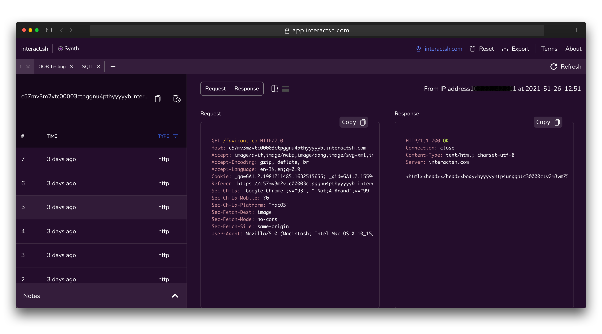
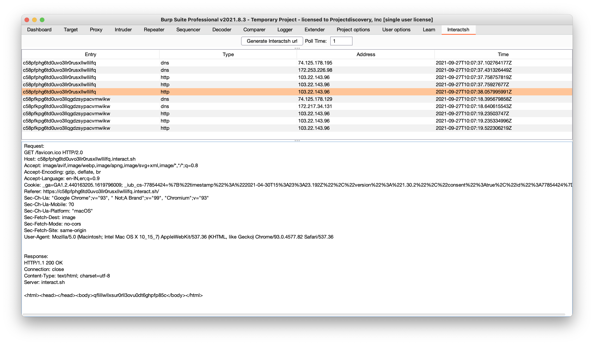
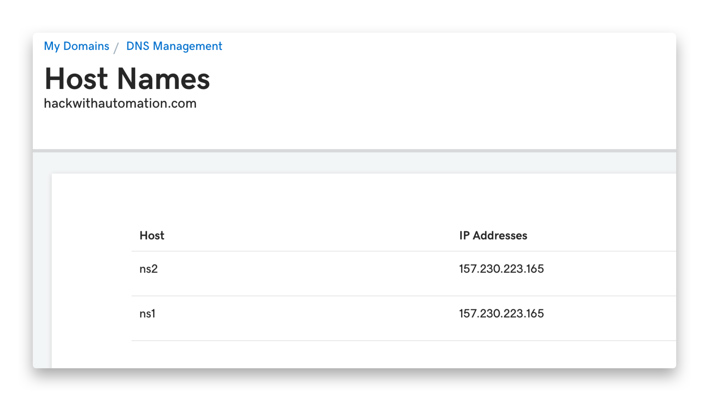
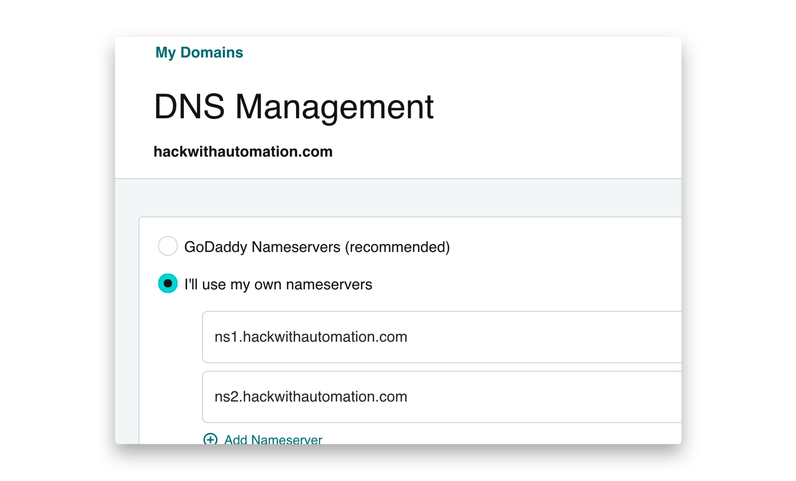
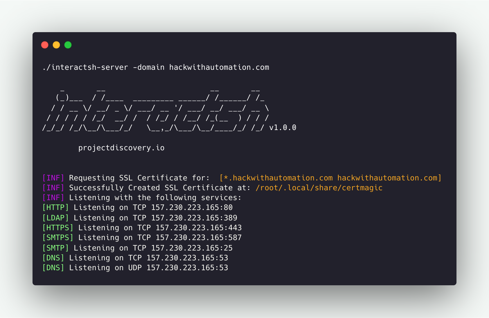

# interact.sh 介绍

> Interactsh是一个开源工具，用于检测带外交互。它专门设计用来发现那些会导致系统与外部产生联系的漏洞。

## 主要功能

- 多协议交互：支持DNS、HTTP（S）、SMTP（S）、LDAP等多种协议的交互，能够检测各种类型的漏洞。
- 多客户端支持：提供CLI、Web、Burp、ZAP、Docker等多种客户端，方便用户集成到不同的工作流程中。
- AES加密与零日志：采用AES加密，保护数据隐私，且不记录任何日志，确保用户数据的安全性。
- 自动ACME证书：支持基于ACME协议的通配符TLS证书自动生成和续签，方便部署。
- 云元数据服务DNS记录：支持云元数据服务创建DNS记录，便于在云环境中使用。
- 动态HTTP响应控制：可以自定义HTTP响应内容，灵活应对不同的测试场景。
- 自托管Interactsh服务器：支持将Interactsh部署在自己的服务器上，实现完全的控制。
- 多域名支持：自托管版本支持多个域名，方便管理不同的项目。
- NLTM/SMB/FTP(S/RESPONDER监听器：自托管版本支持多种协议的监听器，扩展了检测范围。
- 通配符与保护交互：自托管版本支持通配符和保护交互，提高了灵活性。
- 自定义索引与文件托管：自托管版本支持自定义索引和文件托管，方便进行定制化开发。
- 自定义有效载荷长度：自托管版本支持自定义有效载荷长度，适应不同的测试需求。
- 自定义SSL证书：自托管版本支持自定义SSL证书，增强安全性。

## Interactsh 客户端

## 用法

``` bash
interactsh-client -h
```

该命令将显示工具的帮助信息，以下列出了所有支持的选项：

``` bash
Usage:
  ./interactsh-client [flags]

Flags:
INPUT:
   -s, -server string  interactsh server(s) to use (default "oast.pro,oast.live,oast.site,oast.online,oast.fun,oast.me")
   # 指定要使用的Interactsh服务器（默认："oast.pro,oast.live,oast.site,oast.online,oast.fun,oast.me"）

CONFIG:
   -config string                           flag configuration file (default "$HOME/.config/interactsh-client/config.yaml") 
   #指定配置文件路径（默认："$HOME/.config/interactsh-client/config.yaml"
   -n, -number int                          number of interactsh payload to generate (default 1)
   #  生成Interactsh有效载荷的数量（默认1）
   -t, -token string                        authentication token to connect protected interactsh server
   # 连接受保护Interactsh服务器所需的认证令牌
   -pi, -poll-interval int                  poll interval in seconds to pull interaction data (default 5)
   # 轮询间隔（秒），用于拉取交互数据（默认5秒）
   -nf, -no-http-fallback                   disable http fallback registration
   # 禁用HTTP回退注册
   -cidl, -correlation-id-length int        length of the correlation id preamble (default 20)
   #   关联ID前缀的长度（默认20）
   -cidn, -correlation-id-nonce-length int  length of the correlation id nonce (default 13)
   #  关联ID随机数的长度（默认13）
   -sf, -session-file string                store/read from session file
   #     存储或读取会话文件

FILTER:
   -m, -match string[]   match interaction based on the specified pattern # 根据指定模式匹配交互
   -f, -filter string[]  filter interaction based on the specified pattern # 根据指定模式过滤交互
   -dns-only             display only dns interaction in CLI output #   仅显示DNS交互
   -http-only            display only http interaction in CLI output #   仅显示HTTP交互
   -smtp-only            display only smtp interactions in CLI output # 仅显示SMTP交互

UPDATE:
   -up, -update                 update interactsh-client to latest version # 更新interactsh-client到最新版本
   -duc, -disable-update-check  disable automatic interactsh-client update check #禁用自动检查interactsh-client更新
   
OUTPUT:
   -o string                         output file to write interaction data # 指定输出文件，用于写入交互数据
   -json                             write output in JSONL(ines) format # 以JSONL格式写入输出
   -ps, -payload-store               enable storing generated interactsh payload to file # 启用存储生成的Interactsh有效载荷
   -psf, -payload-store-file string  store generated interactsh payloads to given file (default "interactsh_payload.txt") # 将生成的Interactsh有效载荷存储到指定文件（默认："interactsh_payload.txt"）
   -v                                display verbose interaction #   显示详细交互信息

DEBUG:
   -version            show version of the project # 显示项目版本
   -health-check, -hc  run diagnostic check up # 运行诊断检查
```

## Interactsh 命令行客户端

Interactsh命令行客户端需要 go1.20+ 版本以上的Go语言环境才能成功安装。运行以下命令获取代码仓库

``` bash
go install -v github.com/projectdiscovery/interactsh/cmd/interactsh-client@latest
```

### 默认运行

这将生成一个独特的有效载荷，可用于OOB测试，并且在输出中包含最少的交互信息。

``` bash
interactsh-client

    _       __                       __       __  
   (_)___  / /____  _________ ______/ /______/ /_ 
  / / __ \/ __/ _ \/ ___/ __ '/ ___/ __/ ___/ __ \
 / / / / / /_/  __/ /  / /_/ / /__/ /_(__  ) / / /
/_/_/ /_/\__/\___/_/   \__,_/\___/\__/____/_/ /_/ v0.0.5

        projectdiscovery.io

[INF] Listing 1 payload for OOB Testing
[INF] c23b2la0kl1krjcrdj10cndmnioyyyyyn.oast.pro

[c23b2la0kl1krjcrdj10cndmnioyyyyyn] Received DNS interaction (A) from 172.253.226.100 at 2021-26-26 12:26
[c23b2la0kl1krjcrdj10cndmnioyyyyyn] Received DNS interaction (AAAA) from 32.3.34.129 at 2021-26-26 12:26
[c23b2la0kl1krjcrdj10cndmnioyyyyyn] Received HTTP interaction from 43.22.22.50 at 2021-26-26 12:26
[c23b2la0kl1krjcrdj10cndmnioyyyyyn] Received DNS interaction (MX) from 43.3.192.3 at 2021-26-26 12:26
[c23b2la0kl1krjcrdj10cndmnioyyyyyn] Received DNS interaction (TXT) from 74.32.183.135 at 2021-26-26 12:26
[c23b2la0kl1krjcrdj10cndmnioyyyyyn] Received SMTP interaction from 32.85.166.50 at 2021-26-26 12:26

```

### 会话文件

使用 `interactsh-client` 命令并加上 `-sf` 或 `-session-file` 选项可以将当前会话信息存储到或读取自用户定义的文件。这对于在客户端停止或关闭后恢复同一会话以轮询交互非常有用。

``` bash
interactsh-client -sf interact.session

    _       __                       __       __  
   (_)___  / /____  _________ ______/ /______/ /_ 
  / / __ \/ __/ _ \/ ___/ __ '/ ___/ __/ ___/ __ \
 / / / / / /_/  __/ /  / /_/ / /__/ /_(__  ) / / /
/_/_/ /_/\__/\___/_/   \__,_/\___/\__/____/_/ /_/ 1.0.3

        projectdiscovery.io

[INF] Listing 1 payload for OOB Testing
[INF] c23b2la0kl1krjcrdj10cndmnioyyyyyn.oast.pro

[c23b2la0kl1krjcrdj10cndmnioyyyyyn] Received DNS interaction (A) from 172.253.226.100 at 2021-26-26 12:26
[c23b2la0kl1krjcrdj10cndmnioyyyyyn] Received DNS interaction (AAAA) from 32.3.34.129 at 2021-26-26 12:26
[c23b2la0kl1krjcrdj10cndmnioyyyyyn] Received HTTP interaction from 43.22.22.50 at 2021-26-26 12:26
[c23b2la0kl1krjcrdj10cndmnioyyyyyn] Received DNS interaction (MX) from 43.3.192.3 at 2021-26-26 12:26
[c23b2la0kl1krjcrdj10cndmnioyyyyyn] Received DNS interaction (TXT) from 74.32.183.135 at 2021-26-26 12:26
[c23b2la0kl1krjcrdj10cndmnioyyyyyn] Received SMTP interaction from 32.85.166.50 at 2021-26-26 12:26
```

### 详细模式

通过在运行 interactsh-client 时添加 -v 参数，可以启用详细模式，从而查看完整的请求和响应。此外，还可以将输出结果保存到文件中以便后续分析。

``` bash
interactsh-client -v -o interactsh-logs.txt

    _       __                       __       __  
   (_)___  / /____  _________ ______/ /______/ /_ 
  / / __ \/ __/ _ \/ ___/ __ '/ ___/ __/ ___/ __ \
 / / / / / /_/  __/ /  / /_/ / /__/ /_(__  ) / / /
/_/_/ /_/\__/\___/_/   \__,_/\___/\__/____/_/ /_/ 1.0.3

    projectdiscovery.io

[INF] Listing 1 payload for OOB Testing
[INF] c58bduhe008dovpvhvugcfemp9yyyyyyn.oast.pro

[c58bduhe008dovpvhvugcfemp9yyyyyyn] Received HTTP interaction from 103.22.142.211 at 2021-09-26 18:08:07
------------
HTTP Request
------------

GET /favicon.ico HTTP/2.0
Host: c58bduhe008dovpvhvugcfemp9yyyyyyn.oast.pro
Referer: https://c58bduhe008dovpvhvugcfemp9yyyyyyn.oast.pro
User-Agent: Mozilla/5.0 (Macintosh; Intel Mac OS X 10_15_7) AppleWebKit/537.36 (KHTML, like Gecko) Chrome/93.0.4577.82 Safari/537.36


-------------
HTTP Response
-------------

HTTP/1.1 200 OK
Connection: close
Content-Type: text/html; charset=utf-8
Server: oast.pro

<html><head></head><body>nyyyyyy9pmefcguvhvpvod800ehudb85c</body></html>
```

### 使用自托管server

使用 server 选项，可以配置 interactsh-client 连接到自托管的Interactsh服务器。该选项可以接受一个或多个用逗号分隔的服务器地址。

```bash
interactsh-client -server hackwithautomation.com
```

我们维护了一组默认的Interactsh服务器供 interactsh-client 使用：

```yaml
oast.pro
oast.live
oast.site
oast.online
oast.fun
oast.me
```

默认服务器随时可能发生变化、轮换或宕机，因此我们建议您使用自托管的Interactsh服务器，以避免因默认服务器出现问题而影响使用。

### 使用受保护的自托管服务器

通过使用 `token` 选项，`interactsh-client` 可以连接到一个受身份验证保护的自托管Interactsh服务器。

```bash
interactsh-client -server hackwithautomation.com -token XXX
```

### 与Notify配合使用

如果您不在终端前，可以使用 notify 将实时交互通知发送到任何支持的平台。

```bash
interactsh-client | notify
```

##  Interactsh Web客户端

Interactsh-web是一个免费开源的Web客户端，可以在你的浏览器中以一个易于管理的仪表板形式展示Interactsh的交互。它使用浏览器的本地存储来存储和显示所有传入的交互。默认情况下，Web客户端被配置为使用interact.sh作为默认的Interactsh服务器，并且也支持其他自托管的公共/认证的Interactsh服务器。 

一个托管的Interactsh-web客户端实例可以在https://app.interactsh.com访问。



## Interactsh Docker镜像

Interactsh客户端还提供了一个现成的Docker镜像，可以直接运行，使用方法如下：

``` bash
docker run projectdiscovery/interactsh-client:latest
```

```bash
docker run projectdiscovery/interactsh-client:latest

    _       __                       __       __  
   (_)___  / /____  _________ ______/ /______/ /_ 
  / / __ \/ __/ _ \/ ___/ __ '/ ___/ __/ ___/ __ \
 / / / / / /_/  __/ /  / /_/ / /__/ /_(__  ) / / /
/_/_/ /_/\__/\___/_/   \__,_/\___/\__/____/_/ /_/ v1.0.0

        projectdiscovery.io

[INF] Listing 1 payload for OOB Testing
[INF] c59e3crp82ke7bcnedq0cfjqdpeyyyyyn.oast.pro
```

## Burp Suite扩展

interactsh-collaborator 是由 @wdahlenb 开发并维护的Burp Suite扩展。

- 从 releases 页面下载最新的JAR文件。
- 打开Burp Suite → Extender → Add → Java → 选择JAR文件 → Next 
- 安装成功后，会新出现一个名为Interactsh的选项卡。 
- 有关更多信息，请参阅interactsh-collaborator项目。



## Interactsh服务器

Interactsh服务器运行多个服务，并捕获所有传入的请求。为了托管一个Interactsh服务器实例，你需要设置以下内容： 

- 带有自定义主机名和命名服务器的域名。 
- 后台持续运行的基本云服务器实例。

### 用法

``` bash
interactsh-server -h
```

这将显示该工具的帮助信息。以下为其支持的所有开关。

```bash
Usage:
  ./interactsh-server [flags]

Flags:
INPUT:
   -d, -domain string[]                     single/multiple configured domain to use for server
   -ip string                               public ip address to use for interactsh server
   -lip, -listen-ip string                  public ip address to listen on (default "0.0.0.0")
   -e, -eviction int                        number of days to persist interaction data in memory (default 30)
   -ne, -no-eviction                        disable periodic data eviction from memory
   -a, -auth                                enable authentication to server using random generated token
   -t, -token string                        enable authentication to server using given token
   -acao-url string                         origin url to send in acao header to use web-client) (default "*")
   -sa, -skip-acme                          skip acme registration (certificate checks/handshake + TLS protocols will be disabled)
   -se, -scan-everywhere                    scan canary token everywhere
   -cidl, -correlation-id-length int        length of the correlation id preamble (default 20)
   -cidn, -correlation-id-nonce-length int  length of the correlation id nonce (default 13)
   -cert string                             custom certificate path
   -privkey string                          custom private key path
   -oih, -origin-ip-header string           HTTP header containing origin ip (interactsh behind a reverse proxy)

CONFIG:
   -config string               flag configuration file (default "$HOME/.config/interactsh-server/config.yaml")
   -dr, -dynamic-resp           enable setting up arbitrary response data
   -cr, -custom-records string  custom dns records YAML file for DNS server
   -hi, -http-index string      custom index file for http server
   -hd, -http-directory string  directory with files to serve with http server
   -ds, -disk                   disk based storage
   -dsp, -disk-path string      disk storage path
   -csh, -server-header string  custom value of Server header in response
   -dv, -disable-version        disable publishing interactsh version in response header

UPDATE:
   -up, -update                 update interactsh-server to latest version
   -duc, -disable-update-check  disable automatic interactsh-server update check
   
SERVICES:
   -dns-port int           port to use for dns service (default 53)
   -http-port int          port to use for http service (default 80)
   -https-port int         port to use for https service (default 443)
   -smtp-port int          port to use for smtp service (default 25)
   -smtps-port int         port to use for smtps service (default 587)
   -smtp-autotls-port int  port to use for smtps autotls service (default 465)
   -ldap-port int          port to use for ldap service (default 389)
   -ldap                   enable ldap server with full logging (authenticated)
   -wc, -wildcard          enable wildcard interaction for interactsh domain (authenticated)
   -smb                    start smb agent - impacket and python 3 must be installed (authenticated)
   -responder              start responder agent - docker must be installed (authenticated)
   -ftp                    start ftp agent (authenticated)
   -smb-port int           port to use for smb service (default 445)
   -ftp-port int           port to use for ftp service (default 21)
   -ftps-port int          port to use for ftps service (default 990)
   -ftp-dir string         ftp directory - temporary if not specified

DEBUG:
   -version            show version of the project
   -debug              start interactsh server in debug mode
   -ep, -enable-pprof  enable pprof debugging server
   -health-check, -hc  run diagnostic check up
   -metrics            enable metrics endpoint
   -v, -verbose        display verbose interaction
```

我们使用 GoDaddy 作为域名注册商，并使用 DigitalOcean 的 $5 基础云服务器来运行自托管的 Interactsh 服务器。如果您没有使用 GoDaddy，请按照您所使用的域名注册商的流程来创建或更新 DNS 记录。

**配置 Interactsh 域名**

- 导航到 https://dcc.godaddy.com/control/portfolio/{{domain}}/settings?subtab=hostnames

- 点击“添加”（Add），然后提交 `ns1` 和 `ns2`，并将您的 `SERVER_IP` 作为值。



- 导航到 https://dcc.godaddy.com/control/dnsmanagement?domainName={{domain}}&subtab=nameservers

- 选择“更改域名服务器”（Change Nameservers）

- 选择“我将使用自己的域名服务器”（I'll use my own nameservers）

- 提交 ns1.INTERACTSH_DOMAIN 和 ns2.INTERACTSH_DOMAIN



## 在您的 VPS 上安装 interactsh-server

在您的 VPS 上安装 interactsh-server

```bash
go install -v github.com/projectdiscovery/interactsh/cmd/interactsh-server@latest
```

假设域名已经配置完成，运行以下命令启动 interactsh-server

```bash
interactsh-server -domain INTERACTSH_DOMAIN
```

以下是一个成功安装并运行自托管服务器的示例：



为了让 `interactsh-server` 以默认设置运行，一些必要的标志会被自动配置。例如，如果系统有公网 IP 地址，那么 `ip` 和 `listen-ip` 标志就会被设置为这个公网 IP 地址。