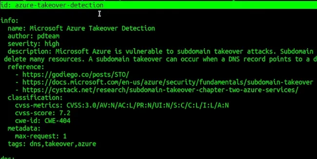
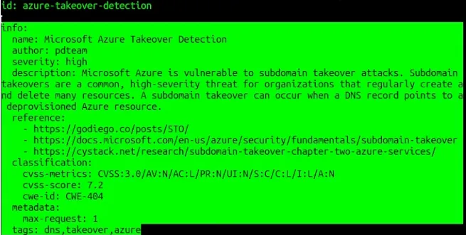
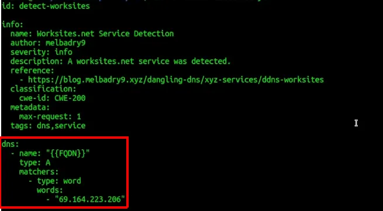
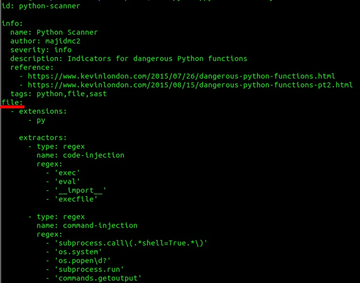
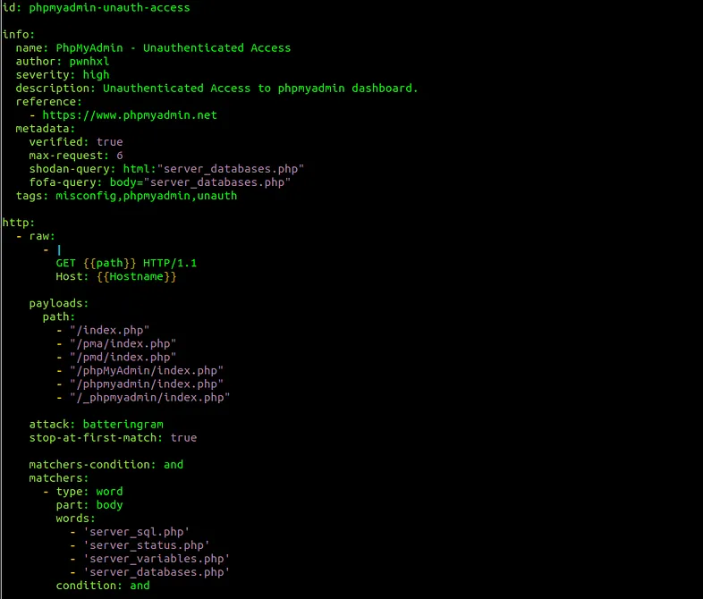
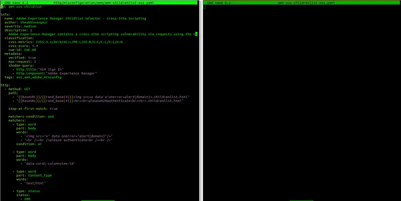
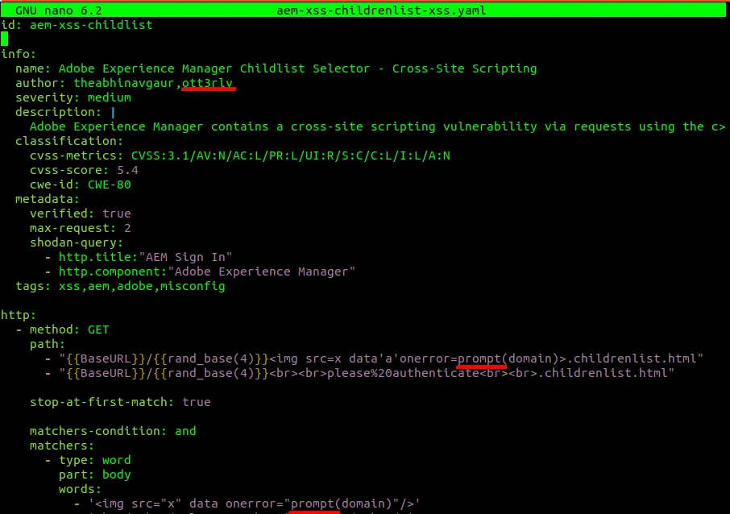
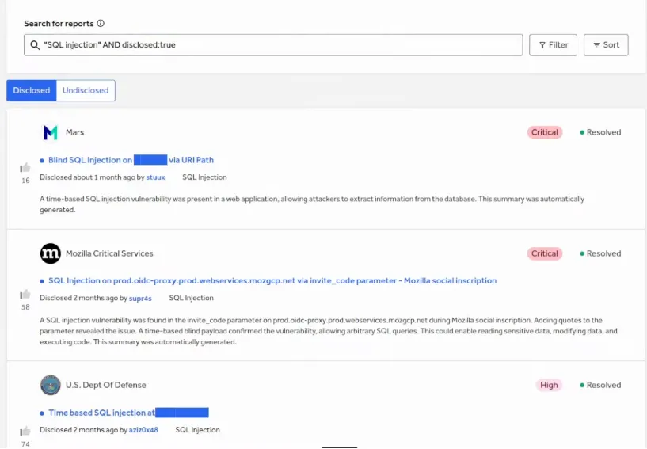
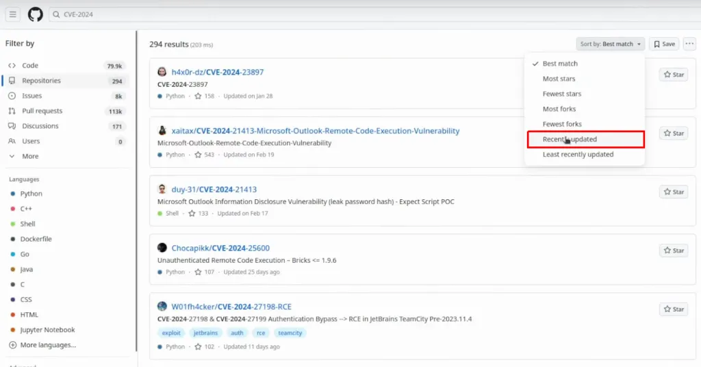

# Nuclei：如何快速构建自己的Nuclei模板

> 此文章将深入讨论论如何创建独特的nuclei模板！不要错过，我会展示三种简单的方法来构建你自己的Nuclei模板！让我们增加你赢得赏金的机会！


Nuclei模板专为测试特定漏洞而设计，涵盖已知错误配置、CVE、默认凭证、通用模糊测试技术等。它使用一种非常强大的方式来描述如何检测问题，同时也是大规模测试的有效方法。该工具预设了许多模板，但直接使用它们可能会导致重复探测。使用自定义模板可以大幅提高发现漏洞的概率！如果我说你不必花费太多精力就能创建自己的模板，你会相信吗？开始时无需阅读大量文档，一旦掌握基础，就会发现非常简单。

## 默认目录结构

为了让你更容易构建自己的模板，理解基础结构是必须的。当你安装Nuclei时，模板默认会放在你的主目录下。如果你列出它们，就会看到有多个类别和多个目录：


这些目录根据模板的使用场和运行方式进行分类：

- **headless:** 无头模式的模板。

- **dns：** 主要用于检查DNS记录。

- **file:** 包含针对特定文件的各种检查。因为你可以向工具传递文件而不是URL。

- **http：** 普通的HTTP请求。这次我们将重点关注这里，因为这是最常见的Nuclei使用方式。

- **javascript:** 如果你想在服务端运行一些Javascript函数。

- **network：** 如果你有不同端口的IP，你可以进行一些基于网络的扫描。

- **ssl：** 用于SSL检查。

其他目录如**code** 、**config** 、**helpers** 和**workflows**术语相对高级的功能。

## 模板结构

模板是用YAML编写的，这是一种描述数据非常简单的方式，主要使用键值对。如果我们查看**dns->azure-takeover-detection.yaml** 模板，就会看到三个主要部分。



这标识如果你只想单独使用这个模板的话。你可以使用以下命令在Nuclei中运行它。

```bash
nuclei -u target.com -id azure-takeover-detection
```



模板中会包含一些元数据。其中一些值是强制性的，比如模板的名称、作者、严重性（通常用CVSS分数表示）和描述，但其他部分是可选的，例如参考、分类和元数据。

最后一部分通常是标签。标签也是强制性的，因为它们可以用于运行特定组的多个模板。在本例中，可以使用`dns` 标签来运行此目录中的DNS模板。要运行特定组的模板，可以使用以下命令：

```bash
nuclei -u target.com -tags dns
```



在这里，`dns` 部分会告诉Nuclei你希望如何发送DNS请求，而`matchers` 部分则会指定在什么条件下将结果显示到终端。在本例中，如果DNS记录包含字符串`69.164.223.206` ，就会显示结果。

第三部分还有其他类型，例如`file` ，它可以用于像`python-scanner.yaml` 模板那样使用Nuclei扫描文件。



正如你所注意到的，前两部分是相同的 `--id` 和`info` ，但第三部分将会是`file`。

尽管Nuclei提供了多种模板选项，但大多数人主要使用它来发送HTTP请求，所以让我们来探索一下基于HTTP的模板。编写那些基于HTTP的模板主要有几种方式。让我们来研究一下`phpmyadmin-misconfiguration.yaml` 这个文件：


这是一个用于检测phpMyadmin配置错误的模板。它包含了我们已经熟悉的`id`和`info`部分，但这次你还会看到一个`http` 部分。使用Nuclei发送HTTP请求有多种方式：



正如你所看到的，你可以使用`raw` 关键字，并将请求按照你在Burp中看到的方式指定。这样，你可以使用其他HTTP动词（如POST、PUT等）来发送HTTP请求。

## 方法一：在原有模板的基础上不断的修改、尝试新的策略

正如我们刚刚学习到的模板核心结构，现在是时候学习构建自己的模板的第一种方法了。我建议首先阅读现有的预制模板，然后尝试做类似的事情。我喜欢将终端分成两部分。在本例中，我选择了`aem-xss-childrenlist-xss.yaml` 文件作为示例：



在右侧，我是用nano编辑器打开了一个新文件，文件名与左侧的模板相同。我将这个新文件创建在了`~/nuclei-templates-cust/`目录下。使用这种方法的第一步就是尝试将左侧的所有内容复制到右侧，然后进行编辑。


正如你可能注意到的，就像nano这样的编辑器有一些缺点——复制时某些行可能会被截断。在这种情况下，只是描述，影响不大，但在其他情况下，你可能会犯一些简单的错误，所以请记住这一点。我建议使用更好的文本编辑器，比如vscode。我喜欢一直待在终端，所以我这次将使用nano。

所以回到自定义模板的编辑......我想使用`prompt`函数而不是`alert()` 。这样做是为了在WAF阻止`alert()` JS函数的情况下使用修改后的模板。为此，需要替换路径和匹配器：


我也添加了自己作为作者，同时还给原始作者进行了署名。按下`ctrl+s` ，你的新模板就可以使用了！这是开始探索Nuclei模板引擎最简单的方法，你可以发挥想象力进行各种尝试。你可以尝试在`{{BaseURL}` 附近添加更多端点，可以尝试修改有效负载等。

另一个使用此方法的好例子是尝试查找LFI。通常，LFI模板会查找`/etc/passwd` 文件，但您可以修改它们来搜索WIndows操作系统文件！只需替换有效负载和匹配器即可。

> LFI（本地文件包含漏洞，Local File Inclusion）,是设计程序时，没有对用户输入的文件路径进行严格的过滤和检查，导致攻击者可以通过构造特殊的请求，让服务器加载并执行任意文件。

有时你可以尝试更改方法，而不是`Get` ，你可以尝试更改为`Post`或`Put` ，你可能会惊讶地发现一些东西。但不要在已知的CVE上使用它。

## 方法二：搜索安全漏洞情报

在运行现有模板并可能阅读模板文档之后，你将深入了解Nuclei模板的深层知识。提升水平的第二件事是检查安全漏洞信息，这是一种获得构建自己的模板灵感的好方法。我最喜欢的两个地方是X和hackeone的Hacktivity。

因此，在X上，你应该使用这些搜索字段--`#bugbounty tips` 和`valnerability type`。


理想情况下，你会找到想找到的有效负载和易受攻击的端点。添加`payloads`关键词也是一个好主意：

在HackerOne上，你还应该找到你想要的那种漏洞类型的公开报告。



接下来，你需要找到一个类似的现有Nuclei模板，然后尝试将该模板复制到新的模板中，就像之前一样，只需替换有效负载或者端点即可。

## 方法三：安全研究

最后，第三种方法就是进行安全研究。这有简单和困难两种方式：

简单的方法是查找最近的CVE，并尝试在其他人之前找到漏洞代码，然后围绕它创建Nuclei模板。通常搜索漏洞的地方是Github。我喜欢做的是写下CVE和CVE的年份，然后按最近更新排序。



这样，你可以按日期找到很多漏洞。通常，这些漏洞是用Python编写的，因此你还需要在侧边栏按Python语言排序。

另外，最好检查一下该CVE号码是否尚未包含在默认的Nuclei模板库中。如果它已经包含在Nuclei模板中，那么你首先在目标上找到CVE的机会就不大了。所以基本上这就像一场老鼠赛跑......

如果你想有99%的机会不重复，你应该专业地去做，通过进行安全研究，这是困难的方式。你需要阅读许多漏洞赏金计划使用的目标软件的代码，了解漏洞发生的位置和方式，并尝试找到0Day漏洞。要找到0day漏洞，我建议选择Github，Dockerhub或其他地方的开源项目。对于这些漏洞，你应该创建Nuclei模板。白盒安全测试是一个巨大的话题，本文已经很长了，所以这次我不会深入细节。

## 最后的思考

如果你坚持看到这里，恭喜你，你已经具备了开始构建Nuclei模板的足够知识！


