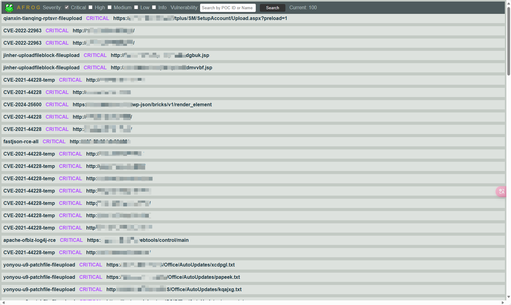
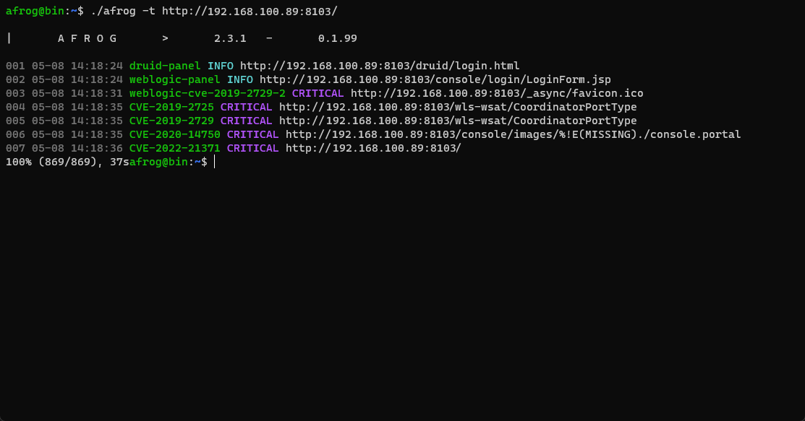

# 挖洞神器：Afrog

> 一款用于漏洞赏金、渗透测试和红队演练的安全工具。

## afrog 是什么？

afrog是一款高性能漏洞扫描器，速度快且稳定。它支持用于自定义PoC（Proof of Concept，概念验证），并具有多种内置类型，如CVE（Common Vulnerbilities and Exposures）、CNVD（中国国家漏洞库）、默认密码、信息泄露、指纹识别、未授权访问、任意文件读取和命令执行。通过afrog，网络安全专业人员可以快速验证和修复漏洞，从而帮助其安全防御能力。

## 特征

- 开源
- 快速、稳定，误报率低
- 详细的HTML漏洞报告
- 可自定义且稳定更新的PoC
- 活跃的社区交流群

## 运行afrog

默认情况下，afrog会扫描所有内置的PoC。如果发现任何漏洞，它会自动生成一个HTML报告，并以扫描日期作为文件名。

示例：

``` bash
afrog -t https://example.com
```

**运行afrog时出现警告**

如果你看到以下错误信息：

``` bash
[ERR] ceye reverse service not set: /home/afrog/.config/afrog/afrog-config.yaml
```

这意味着你需要修改配置文件。

要执行自定义Poc目录，可以使用以下命令：

``` bash
afrog -t https://example.com -P mypocs/
```

使用`-s`关键字可以再所有Poc进行模糊搜索并扫描搜索结果。多个关键字之间用逗号分隔。例如：`-s weblogic, jboss`

```bash
afrog -t https://example.com -s weblogic,jboss
```

使用`-S`关键字根据严重性级别扫描漏洞。严重性级别包括：info、low、medium、high和critical。例如，要扫描高危和严重漏洞，可以使用命令`-S hig, critical`。

``` bash
afrog -t https://example.com -S high, critical
```

你也可以同时扫描多个URL

``` bash
afrog -T urls.txt
```

## -Web 命令

`-web`命令允许将afrog扫描到的漏洞持久化存储到一个SQLite3数据库中。通过浏览器访问`http://x.x.x.x:16868`，用户可以访问漏洞报告页，在其中进行简单的关键字搜索并按漏洞严重性过滤结果。

```bash
afrog -web
```



## 配置文件

第一次启动afrog时，它会自动再当前用户目录下的`$HOME/.config/afrog/afrog-config.yaml`路径创建一个名为`afrog-config.yaml`的配置文件。

下面是一个配置文件示例：

```yaml
reverse:
  ceye:
    api-key: "xxxxxxxxxxxxxxxxxxxxxxxxxxxxxx"
    domain: "xxxxxx.cey2e.io"
  dnslogcn:
    domain: dnslog.cn
  alphalog:
    domain: dnslogxx.sh
    api_url: "http://dnslogxx.sh/"
  xray:
    x_token: "xraytest"
    domain: dnslogxx.sh
    api_url: "http://x.x.0.x:8777"
  revsuit:
    token: "xx"
    dns_domain: "log.xx.com"
    http_url: "http://x.x.x.x/log/"
    api_url: "http://x.x.x.x/helplog"
```

`reberse`配置项用于指定一个反向链接平台，用来严重那些无法直接回显结果的命令执行漏洞。目前，afrog只支持ceye作为反向连接平台。

### Ceye 配置

获取`ceye` 的方法如下：

- 访问ceye.io网站并注册一个账号。
- 登录并进入个人设置页面。
- 复制domain和api-key，并再afrog-config.yaml中进行正确的配置。

### DNSlogcn

不需要配置，但稳定性较差

### Alphalog

需要构建服务工具

### xyay

需要构建服务工具

### Revsuit

需要构建服务工具、教程。

## JSON输出（面向开发者）

### JSON

可选命令：`-json`或`-j`,将扫描结果保存为JSON文件。默认情况下，JSON文件包含以下字段：target、fulltarget、id和info。其中info字段包含以下字段：name、author、severity、description和reference。如果想要同时保存请求和响应内容，请使用`-json-all`命令参数。

``` bash
afrog -t https://example.com -json result.json
afrog -t https://example.com -j result.json
```

**警告**

JSON 文件的内容是实时更新的。需要注意的是：再扫描完成之前，如果开发者想要解析文件内容，需要手动在文件末尾添加一个'`]`' 符号，否则后引起解析错误。当然，如果等到扫描完成后再解析文件，就不会出现这个问题。

### JsonALL

可选命令：`-json-all`或`-ja`,`-json-all` 和 `-json`命令的区别在于，`-json-all` 会将所有漏洞结果，包括请i去和响应，写入JSON文件中。

## 运行截图



## 作为库使用

### 简单示例

扫描网站 `http://example.com`

``` go
package main
import (
		"fmt"
    	"github.com/zan9bin/afrog"
)

func main(){
    if err:=afrog.NewScanner([]string{"http://exmaple.com"},afrog.Scanner{}; err != nil{
        fmt.Println(err.Error())
    }
}
```

