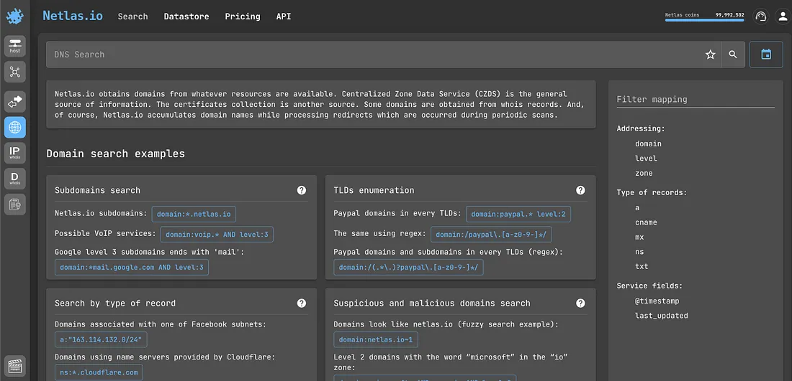
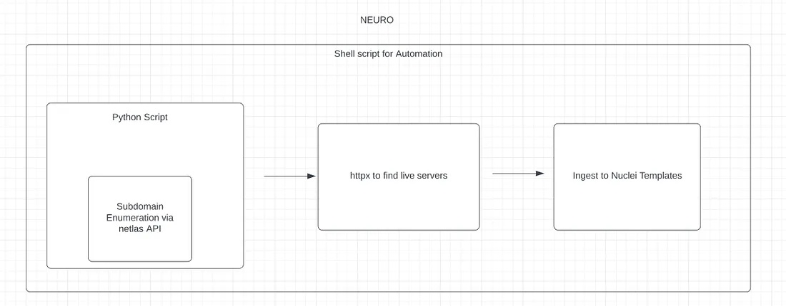

# Netlas侦察自动化+Nuclei自动扫描



Netlas是一个新工具，提供多种服务，如IP WHOIS查询、DNS查询、攻击面发现、证书搜索、响应搜索等。它是一个很好的Shodan替代品。

Netlas还有大量搜索技巧（dorking facilities）。在这片文章中，我们将利用Netlas的Python库，通过Nuclei模板，自动扫描某个域名下的所有子域名漏洞。

## Neuro 项目Github仓库

https://github.com/humblelad/neuro
通过Neuro，我们实现了端到端的自动化流程，将Netlas API与Nuclei模板扫描器结合，从而发现开放漏洞。

请确保在你的漏洞扫描器中安装了httpx、Nuclei和Netlas Python依赖。如果按照文档中的步骤操作，这个过程非常简单。



 **httpx** 安装方法：

```basj
go install -v github.com/projectdiscovery/httpx/cmd/httpx@latest
```

**nuclei** 安装方法：

```bash
go install -v github.com/projectdiscovery/nuclei/v3/cmd/nuclei@latest
```

**Netlas** Python 库

用于下载子域名并获取活动子域名。Netlas Python代码库地址：[https://github.com/netlas-io/netlas-python](https://github.com/netlas-io/netlas-python)

安装方法：

```bash
pip3 install netlas
```

从Netlas仪表盘获取API密钥，并将其放入Python脚本中，然后运行`./run.sh`脚本，并输入要使用Neuro扫描的域名。

目前，脚本会扫描所有严重型和高危型的漏洞模板，并发请求数量为50.你可以根据自己的需要和业务需求来处理这些结果。例如：

- 将扫描结果保存到文件中。

- 创建cron任务自动运行Python脚本

- 设置Slack通知以接收扫描结果更新。

注意：运行shell脚本时，请确保所有相关的Python脚本（.py文件）和文本文件(.txt文件)都位于同一个文件夹中。

```bash
#!/bin/bash
#automate netlas nuclei scan

# Run python3 main.py
python3 main.py

# Check if python3 main.py ran successfully
if [[ $? -ne 0 ]]; then
  echo "python3 main.py failed to run successfully."
  exit 1
fi

#httpx
cat lol.txt | ./httpx > output.txt

if [[ $? -ne 0 ]]; then
  echo "Failed"
  exit 1
fi

# Run nuclei
nuclei -l output.txt -v -severity high,critical -c 50
```
